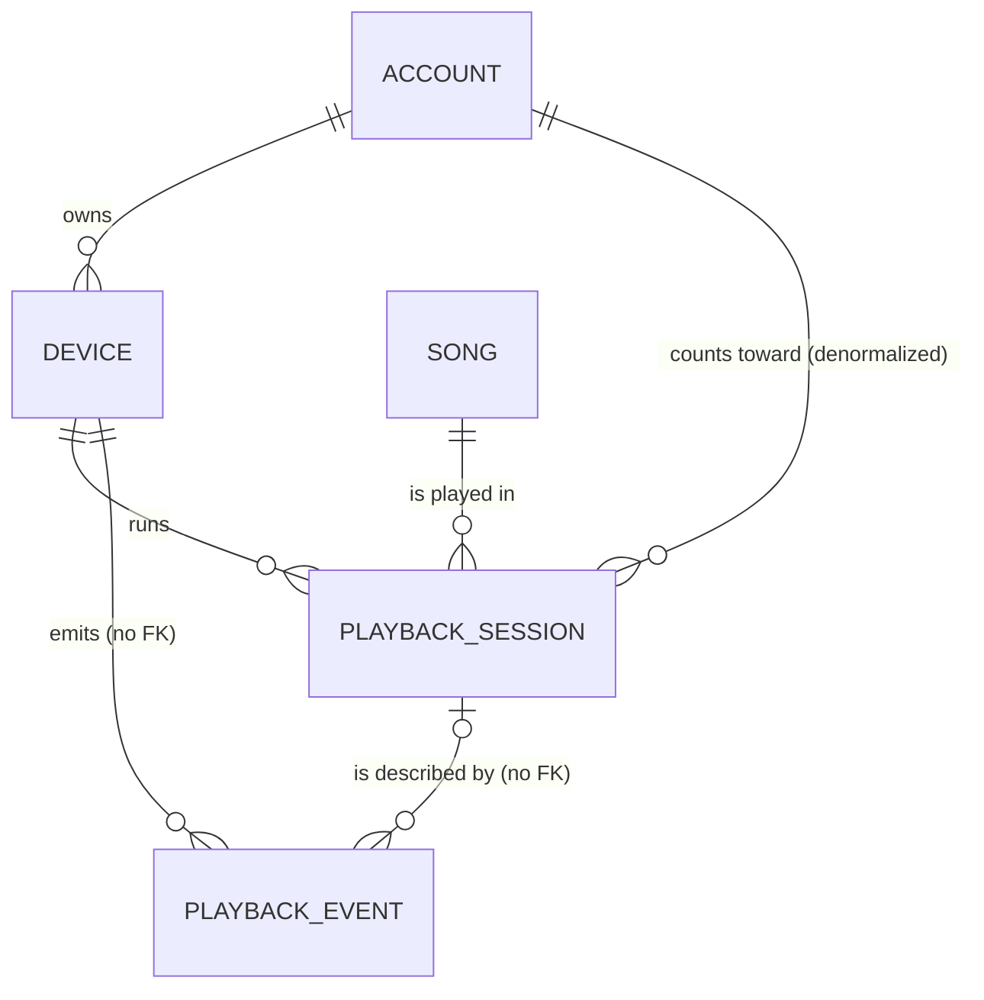

# PlaySync

**Multi-device playback coordination, built as a concurrency-control lab on MySQL/InnoDB.**

A tiny music app: one account, several devices (MacBook, iPhone, iPad, Browser), and a per-account limit on how many may play at once. Underneath the friendly UI it is a laboratory. It protects one database invariant, measures how six different concurrency-control strategies protect (or fail to protect) it, and lets you watch the machinery work: a lock table, a wait-for graph, deadlocks, rollbacks, and a live simulated crowd.

Everything runs locally and for free: MySQL 8.4 in Docker, Node 20+, React. There is **no authentication** (you pick an account by username; login is out of scope) and no paid service, API key or telemetry.

> This README is the overview and carries the report material (sections 5, 8 and 13). The detailed documents live in `docs/`: [PLAN.md](docs/PLAN.md) (original spec), [er.md](docs/er.md), [normalization.md](docs/normalization.md), [concurrency.md](docs/concurrency.md), [experiments.md](docs/experiments.md), [syllabus-map.md](docs/syllabus-map.md), [simulation.md](docs/simulation.md), [ui-voice.md](docs/ui-voice.md), the phase plans in [docs/implementation/](docs/implementation/), the agent guide [CLAUDE.md](CLAUDE.md) and the historical [HANDOFF_STATUS.md](HANDOFF_STATUS.md).

---

## Contents

1. [The idea and the research question](#1-the-idea-and-the-research-question)
2. [What is built](#2-what-is-built)
3. [Quick start](#3-quick-start)
4. [Architecture and repository map](#4-architecture-and-repository-map)
5. [Database design (ER, EER, normalization)](#5-database-design)
6. [Concurrency design](#6-concurrency-design)
7. [REST API and real-time](#7-rest-api-and-real-time)
8. [Experiments and results](#8-experiments-and-results)
9. [The Transaction Stepper](#9-the-transaction-stepper)
10. [The Simulation Control Room](#10-the-simulation-control-room)
11. [The web application](#11-the-web-application)
12. [Testing](#12-testing)
13. [Demo scripts and syllabus map](#13-demo-scripts-and-syllabus-map)
14. [How it was built: phases, branches and state](#14-how-it-was-built)
15. [Design decisions and deviations from the original plan](#15-design-decisions-and-deviations)
16. [Known limits, gotchas and what is not built](#16-known-limits-gotchas-and-what-is-not-built)
17. [Working on this codebase](#17-working-on-this-codebase)

---

## 1. The idea and the research question

A streaming app notices when the same account starts playback on a second device. This project never claims "this is how Apple does it" (the mechanism is not public). It asks the underlying database question directly:

> **Research question.** How can a relational DBMS maintain a consistent, real-time view of concurrent playback sessions across a user's devices, and what are the correctness and performance trade-offs of different concurrency-control strategies for enforcing a per-account stream limit?

**The invariant being protected**

> For every account `a`: the number of sessions with `status = 'PLAYING'` and an unexpired lease is **≤ `a.max_streams`**.

A primary key gives each row an identity; it does not protect this invariant, because the invariant is a predicate over a *set* of rows. It needs concurrency control, and the project demonstrates that empirically.

**Key design corrections (kept in the code and docs)**

1. Two devices both pressing Play is **write skew / a phantom**, not a lost update: both transactions read the same predicate ("active sessions for account 101"), see none, and insert *different* rows. Lost update (two read-modify-writes on the *same* row) gets its own experiment, the song play counter.
2. "Wrap it in a transaction" does **not** fix the race at MySQL's default isolation. At REPEATABLE READ and READ COMMITTED a plain `SELECT` is a non-locking snapshot read, so both transactions still see zero. SERIALIZABLE does prevent it, but InnoDB does so by turning the `SELECT` into shared next-key locks, which makes the two `INSERT`s deadlock; one is rolled back and must retry.
3. **Lock the parent row, not the empty range.** `SELECT … FOR UPDATE` on `playback_session` with no matching rows takes gap locks and invites deadlocks. The correct pessimistic pattern locks the single `account` row as a per-account mutex. The account's primary key is therefore the *lock target* (the real answer to "does it involve a unique primary key?").
4. **Locks and MVCC snapshots interact.** At REPEATABLE READ, a plain `SELECT` *before* taking the account lock fixes the snapshot, so a transaction can violate the invariant while holding the lock. This is Stepper scenario `PESSIMISTIC_RR_PITFALL`. The production pessimistic strategy runs at READ COMMITTED with the lock as its first statement.
5. **Heartbeats alone are not enough; use leases + fencing.** A session holds a lease (`lease_expires_at`) that heartbeats extend. An expired lease can never be revived, and a heartbeat for a preempted/expired session is rejected (HTTP 410), so a "zombie" device (a laptop waking from sleep) cannot resurrect a session that was taken over.
6. **All time comparisons happen in SQL with `NOW(3)`**, one clock. Clients get `leaseRemainingMs` computed by the database, so phone/Mac clock skew doesn't matter.
7. MySQL has **no partial unique indexes and no SQL ASSERTION**. A declarative "one active session per account" is possible with a stored generated column plus a UNIQUE index (NULLs don't collide), but it cannot express "≤ N": itself a finding.
8. **Deliberate denormalization**: `playback_session` stores both `device_id` and `account_id` (a 3NF violation, justified in section 5.4) and consistency is enforced by a **composite foreign key**.
9. **Publish after commit.** Real-time pushes are sent only after `COMMIT`, otherwise clients could see state that is later rolled back (an application-level dirty read).
10. **Every state change bumps `account.state_version`.** That one counter drives optimistic concurrency *and* lets clients discard out-of-order WebSocket messages.
11. Timestamp ordering and the Thomas write rule are not implemented by MySQL; they exist only as a clearly labelled **simulator** (Stats for nerds → Theory, section 8.6).

**What is actually new here** (stated honestly): none of the individual techniques are new. The contribution is the combination: a lease + fencing model for multi-device sessions, version-ordered real-time sync, a reproducible harness measuring invariant violations across six strategies on a real DBMS, and live visualization of InnoDB locks for each schedule (Stepper and Simulation). That goes further than the usual booking-system CRUD project, which shows one locking method without measurement.

---

## 2. What is built

| Area | What you get |
|---|---|
| **Playback app** | Four `brij` devices that are each an independent live client (own socket): play, pause/resume, stop, "Play here instead?" takeover, **Go offline** (zombie device), lease expiry, real-time handoff between tabs and a real phone over the LAN. |
| **Eight claim strategies** | Six core (NAIVE, TXN_RR, SERIALIZABLE, PESSIMISTIC, OPTIMISTIC, CONSTRAINT) plus two Phase 7 stretch strategies (**TRIGGER**: a database trigger; **REDIS_LEASE**: a Redis key-value gatekeeper), live-switchable, each commented with the anomaly it prevents or allows. |
| **Concurrency Lab** | N simultaneous claims behind a barrier, invariant check from SQL, retries/deadlocks/timeouts/latency/throughput, every trial persisted to `experiment_run`; plus a lost-update experiment (4 variants); a CLI bench that writes CSVs and result tables. |
| **Transaction Stepper** | Two real MySQL transactions run one statement at a time; live InnoDB lock table (`data_locks`), wait-for graph, deadlock reports, KILL + undo-log recovery; 8 scenarios. |
| **Simulation Control Room** | A crowd of up to 1,024 virtual listeners making real transactions; live protection switching, Repair, timeline, verdict, run comparison, database overlay. |
| **Friendly web UI** | Light/dark themes, mascot **Melo**, device avatars, scroll-driven story pages with geometric anime.js scenes, collapsible sidebar shell, command palette, neon adaptive sliders. |
| **Stats for nerds** | Ten technical tabs (Checks, Lab, Stepper, **Index**, **Theory**, Action trace, Live state, Audit log, Experiment runs, Database) that *verify* what the friendly pages do. |
| **Docs** | ER/EER, functional dependencies and normalization, concurrency analysis, experiment method + measured results, syllabus map (all in `docs/`, summarised here). |

**State of the branches (see section 14):** everything through Phase 5 and the first UI redesign is committed. Everything after that (the Simulation Control Room, the navigation/story UI, the neon sliders, the Phase 6 index experiment and concurrency analysis, the Phase 7 stretch strategies and Theory tab, and this README) is **uncommitted working-tree changes on `phase-nav`**. All seven original phases are now built; section 16 lists what remains.

---

## 3. Quick start

**Prerequisites:** Node.js 20+ and npm; Docker Desktop (running).

```bash
cp .env.example .env     # skip if .env already exists
npm install              # installs both workspaces (server, web)
npm run db:up            # MySQL 8.4 (host port 3307; applies db/schema.sql + db/seed.sql) and Redis 7 (host port 6380, used only by REDIS_LEASE); waits until healthy
npm run dev              # API on :4000, web UI on :5173 (both bound to the LAN)
```

Open **http://localhost:5173**.

MySQL is published on host port **3307** (`DB_PORT` in `.env`) so it doesn't collide with a local MySQL on 3306; the same variable drives `docker-compose.yml` and the server.

### Scripts

| Script | What it does |
|---|---|
| `npm run db:up` | Start the MySQL and Redis containers and wait until healthy (schema + seed loaded) |
| `npm run db:down` | Stop the container (data kept) |
| `npm run db:reset` | Drop the volume and recreate the DB from `schema.sql` + `seed.sql` (needed after **any** schema change) |
| `npm run db:shell` | `mysql` client inside the container |
| `npm run dev` | Server (tsx watch) + web (Vite) together |
| `npm test` | Server suite (real MySQL, files run sequentially) then web unit tests |
| `npm -w server run test:fast` | Server tests without the slow lab and simulation tests (~6 s vs ~40–90 s) |
| `npm run typecheck` | `tsc` on both workspaces |
| `npm -w web run build` | Production bundle (a recharts chunk-size warning is expected) |
| `npm run bench` | Full experiment matrix (~1,200 trials, several minutes): writes CSVs to `docs/results/` and refreshes the tables in `docs/experiments.md` (and, by hand, section 8.3 below) |
| `npm run bench -- --quick` | Fast smoke test of the same pipeline (~1 minute) |
| `npm run bench -- --trials N` / `--only stream\|lost` / `--no-md` / `--stretch` | Override trial count / run one experiment / skip updating `docs/experiments.md` / also run TRIGGER and REDIS_LEASE |

### On a real phone

1. Find your Mac's LAN IP: `ipconfig getifaddr en0`
2. With `npm run dev` running, open `http://<mac-ip>:5173/device?account=brij&device=iPhone` on the phone (same Wi-Fi). The sidebar's **Use your phone** button shows this link with a copy button.
3. Allow the macOS firewall prompt for Node. Campus Wi-Fi often isolates clients; if the phone can't connect, use the phone's hotspot and join it from the Mac.

### Troubleshooting

- **`EADDRINUSE :4000` or `:5173`**: another `npm run dev` is running. Stop it and start again (never kill processes you didn't start).
- **"DB unreachable" / red status dot in the sidebar**: Docker isn't running or the container is down: `npm run db:up`.
- **Port 3307 taken**: change `DB_PORT` in `.env`, then `npm run db:reset`. **Port 6380 taken** (Redis): change `REDIS_PORT` and `REDIS_URL` in `.env`.
- **REDIS_LEASE claims fail with a Redis connection error**: the Redis container is down; `npm run db:up` (only that strategy needs it).
- **Weird database state**: `npm run db:reset`.

---

## 4. Architecture and repository map

**Stack**

| Layer | Choice |
|---|---|
| Database | MySQL 8.4 (`mysql:8.4`), InnoDB, `performance_schema` on, `innodb_print_all_deadlocks=ON`, `max_connections=300`; Redis 7 (`redis:7-alpine`) for the stretch strategy |
| Backend | Node 20+/25, TypeScript (strict, `noUncheckedIndexedAccess`), Express 4, `mysql2/promise` (**raw parameterized SQL only, no ORM**), `socket.io`, `zod`, `ioredis` (REDIS_LEASE only) |
| Frontend | React 18, Vite 5, TypeScript, Tailwind v4 (CSS-first `@theme`), React Router 6, `socket.io-client`, `recharts` (Stats for nerds only), **anime.js v4.5** (all authored motion), `motion` (only inside vendored Watermelon components), `lucide-react` |
| Tests | `vitest` + `supertest` against the real Dockerized MySQL |
| Tooling | npm workspaces (`server`, `web`), `tsx` |

```
db/schema.sql, db/seed.sql        Loaded only when the Docker volume is created (schema change => npm run db:reset)
docs/results/                     Per-trial CSVs written by the bench
scripts/bench.ts                  CLI experiment matrix (runs in-process against the lab modules)

server/src/
  config.ts, app.ts, index.ts     zod env (LEASE_MS 15000, HEARTBEAT_MS 5000, REAPER_MS 2000, pools 20/120); createApp() for supertest; listen + socket.io + reaper + shutdown
  db/                             pool.ts (appPool, labPool, dbConnectionOptions), tx.ts (withTx, withRetry, OccConflictError),
                                  errors.ts (1062/1205/1213/1452), namedLock.ts (GET_LOCK helper)
  strategies/                     types.ts, common.ts (shared statements, grant/reject), eight strategy files (six core + trigger.ts, redisLease.ts), artifacts.ts (prepareForStrategy: unique index / trigger management), index.ts (registry + executeClaim idempotency)
  services/                       playback.ts (claim/heartbeat/pause/release/settings/endAll/live strategy), accountState.ts (bumpVersion, snapshot),
                                  leaseReaper.ts (reapOnce, reapAccount, startReaper), checks.ts (six live SQL assertions)
  realtime/                       presence.ts, publisher.ts (publish-after-commit interface), socket.ts (rooms: account:{id}, device:{id}, stepper, sim)
  lab/                            raceRunner.ts, lostUpdate.ts, invariant.ts, persist.ts, stats.ts, labLock.ts,
                                  stepper/ (types, scenarios, engine, locks, emitter),
                                  sim/ (types, config, engine, device, truth, metrics, names, emitter)
  routes/                         health, info, accounts, playback, lab, stepper, sim, http.ts (asyncHandler + error mapping)
server/test/                      one file per area (helpers.ts has resetAccount(), deviceIds(), expireLease(), count())

web/src/
  App.tsx, main.tsx, index.css    providers, lazy routes, page wrapper (scroll memory, focus), theme tokens + layout variables
  lib/                            api.ts (typed fetch, traces non-GETs), socket.ts, versionedStore.ts, useDeviceSession.ts, trace.ts, theme.tsx, toast.tsx,
                                  motion.ts (anime presets), shell.tsx, keys.ts, chrome.ts (effect switches), scrollMemory.ts, sim.ts,
                                  story/ (progress.ts, scrollBus.ts, useScrollProgress.ts, autoAdvance.ts, history.ts)
  components/
    shell/                        AppShell, Sidebar, SidebarItem, TopBar, TabBar, MoreSheet, Tooltip, PhonePopover, ScrollChrome, nav.ts
    story/                        Story, Chapter, StickyStage, ChapterRail, NextHint, ActionBar, AutoAdvanceToast
    geo/                          pieces.tsx (geometric vocabulary), Glyph.tsx, useGeoScene.ts
    home/                         HomeScene.tsx, GeoMascot.tsx
    device/                       DeviceCard, DeviceAvatar, NowPlaying, PlayerControls, AskSheet, deviceMessages
    sim/                          SimStory (SimPage), useSimControl, SimScene, PresetBar, RelayConditions, HouseholdGrid/Card, DeviceTile, LimitMeter,
                                  PulseStrip, BreachMeter, FeedbackFeed, TimelineChart, RunSummary, CompareRuns, DatabaseOverlay
    nerds/                        one file per Stats-for-nerds tab
    watermelon/                   vendored: command-search, feature-tour, copy-confirm, adaptive-slider
    ui.tsx, Mascot.tsx, Verdict.tsx, RaceTrack.tsx, DevicesTour.tsx
  pages/                          HomePage, DevicePage, NerdsPage, StressTestPage (+ devices/ and stress/ story folders)
```

---

## 5. Database design

### 5.1 Tables

| Table | Purpose | Keys |
|---|---|---|
| `account` | A listener. `max_streams` (1–10, CHECK), `conflict_policy` (REJECT/TAKEOVER/ASK), `state_version` (bumped on every state change), `is_lab` | PK `account_id`; UNIQUE `username` |
| `device` | A device of an account; `device_type` ENUM('DESKTOP','MOBILE','TABLET','WEB') (EER discriminator), `last_seen_at` | PK `device_id`; UNIQUE `(account_id, device_name)`; UNIQUE `(device_id, account_id)` (target of the composite FK); FK `account_id` ON DELETE CASCADE |
| `song` | Made-up songs (no audio; playback is a simulated progress bar); `play_count` is the lost-update target | PK `song_id` |
| `playback_session` | One playback lease: `status` PLAYING/PAUSED/ENDED/PREEMPTED/EXPIRED, `position_ms`, `started_at`, `lease_expires_at`, `ended_at`, `strategy`, generated `active_account_id` | PK `session_id`; composite FK `(device_id, account_id)` → `device`; FK `song_id`; indexes `ix_session_account_status_lease (account_id, status, lease_expires_at)`, `ix_session_status_lease (status, lease_expires_at)` |
| `playback_event` | Append-only audit log: CLAIM_GRANTED, CLAIM_REJECTED, PREEMPTED, PAUSED, RELEASED, EXPIRED, HEARTBEAT_REJECTED; `state_version`, `client_request_id` (idempotency), `detail` JSON | PK `event_id`; UNIQUE `(device_id, client_request_id)`; index `(account_id, created_at)`; **no FKs on purpose** |
| `experiment_run` | One row per experiment trial (config, outcomes, violations, p50/p95, throughput, `wall_ms`, `batch_id`, `trial`, `source` UI/API/BENCH/TEST/**SIM**, `detail` JSON) | PK `run_id`; indexes on `batch_id` and `(experiment, created_at)` |

**Seed data:** demo account `brij` (max_streams 1, policy ASK) with MacBook, iPhone, iPad, Browser; 12 songs; 16 lab accounts `lab_01…lab_16` (`is_lab`, policy REJECT, 64 devices each); 2 stepper accounts `step_a`, `step_b` (2 devices each).

**The optional unique index.** `uq_one_active_per_account` on the generated column `active_account_id = IF(status='PLAYING', account_id, NULL)` is **not** created by the schema. It exists only while the CONSTRAINT strategy is in use and is added/dropped exclusively through `setUniqueIndex(conn, present)`. If it existed permanently, NAIVE would be silently protected and the experiment meaningless. Anything that toggles it temporarily (the lab, the simulation) restores it for the live strategy afterwards.

### 5.2 ER model



`EXPERIMENT_RUN` stands alone (results about the lab, not facts about accounts).

| Relationship | Cardinality | Participation | Mapped as |
|---|---|---|---|
| ACCOUNT owns DEVICE | 1 : N | DEVICE total | FK `device.account_id`, ON DELETE CASCADE |
| DEVICE runs SESSION | 1 : N | SESSION total | part of composite FK `(device_id, account_id)` |
| SONG is played in SESSION | 1 : N | SESSION total | FK `song_id` |
| ACCOUNT counts toward SESSION | 1 : N | derived | not a separate relationship: `account_id` copied from the device, kept consistent by the composite FK |
| SESSION is described by EVENT | 1 : N | EVENT partial (a rejected claim has no session) | plain columns, **no FK** |

Session deletion is `RESTRICT`, so a device or song with sessions can't be deleted: history is never silently lost.

**Modelling notes.**
- `playback_session` is a **reified relationship**: the M:N "DEVICE plays SONG" with its own attributes; `(device_id, song_id)` cannot identify a session (one device replays a song), so it gets a surrogate key.
- `playback_event` relates to a *session*, itself a relationship: **aggregation**; events can exist without a session, so `session_id` is nullable.
- **Why the audit log has no FKs:** it should survive deletes of what it describes, and appending must never take `S,REC_NOT_GAP` locks on parent rows. Trade-off: the DB doesn't guarantee referential integrity for events; the application writes them in the same transaction as the change they describe.
- **DEVICE as a weak entity (road not taken):** naturally identified by `(account, device_name)`; a surrogate `device_id` was used instead (short FK, stable under rename) while the natural key stays declared UNIQUE.
- **Generated column relies on NULL semantics:** InnoDB UNIQUE allows any number of NULLs, so the optional index means "at most one PLAYING row per account".

### 5.3 EER: specialization of DEVICE

Disjoint (a device is exactly one kind, single-valued ENUM), **total** (`device_type NOT NULL`), attribute-defined on `device_type`. Mapping options (Elmasri & Navathe): 8A (superclass + a relation per subclass: empty tables, 4-way joins), 8B (subclass relations only: uniqueness and FKs to a device would span 4 tables), **8C single relation with a type attribute (chosen)**: no subclass-specific attributes so no NULL waste, ENUM enforces disjointness, NOT NULL enforces totality; 8D (Boolean flag per subclass: meant for overlapping specializations, allows illegal combinations). If subclass-specific attributes appear later (say `os_version` for MOBILE), 8A becomes preferable.

### 5.4 Functional dependencies and normalization

Every table has a single surrogate PK, so 2NF reduces to "is there a composite candidate key with a partial dependency?"

| Table | Candidate keys | Highest NF | Notes |
|---|---|---|---|
| `account` | `{account_id}`, `{username}` | **BCNF** | both determinants are candidate keys |
| `device` | `{device_id}`, `{account_id, device_name}` | **BCNF** | `{device_id, account_id}` is UNIQUE but a *superkey*, not a candidate key: it exists only so a FK can reference it. 2NF holds: `device_type`/`last_seen_at` aren't determined by `account_id` or `device_name` alone |
| `song` | `{song_id}` | **BCNF** | `{title, artist}` is deliberately *not* a key (live version, remaster); `play_count` is a stored counter kept as the lost-update target |
| `playback_session` | `{session_id}` | **2NF (not 3NF)** | `device_id → account_id` (transitive) and `{status, account_id} → active_account_id` (generated column) |
| `playback_event` | `{event_id}` (+ `{device_id, client_request_id}` over non-NULL rows) | **2NF** | transitive `device_id → account_id`; append-only so no update anomalies; `detail` JSON is opaque (never filtered or joined) |
| `experiment_run` | `{run_id}` | **BCNF** | config columns don't form a key (trials repeat); `batch_id` is a grouping tag, not a key |

**The deliberate 3NF violation in `playback_session`.**
- *Textbook fix:* drop `account_id` and rely on `device` (lossless and dependency-preserving, BCNF).
- *Why we don't:* (1) **index-only counting**: `ix_session_account_status_lease` answers the per-account active count with one range scan; a join through `device` is slower; (2) **smaller lock footprint**: under SERIALIZABLE and the CONSTRAINT expire-`UPDATE`, InnoDB locks every index record it scans, and with `account_id` in the index the locked range is exactly one account's slice; (3) **the UNIQUE-index trick needs it**: an index only covers columns of one table; (4) the invariant stays a single-table predicate.
- *Anomaly control:* the composite FK `(device_id, account_id) → device(device_id, account_id)`. An insert with a mismatched pair fails with 1452 (`rejects a session whose device belongs to a different account` in `schema.test.ts`); moving a device to another account is blocked by RESTRICT while it has sessions (no `ON UPDATE CASCADE`, so past sessions stay attributed to who actually played). The generated column is recomputed by InnoDB and can't be written, so it can never disagree with its source.
- *Conclusion:* controlled denormalization, not an accident.

---

## 6. Concurrency design

### 6.1 Rules the code follows (do not break them)

- **Raw parameterized SQL only** (`?` placeholders); interpolated identifiers come from a whitelist (`withTx` validates the isolation level).
- **Global lock order: `account` → `device` → `playback_session` → `playback_event`.** Every correct path locks the account row first. CONSTRAINT deliberately violates this (session before account), which allows claim/reaper deadlocks: a documented finding.
- **Every state change bumps `account.state_version`** (claim, pause, release, preempt, expire, settings, repair). Heartbeats do not. `bumpVersion()` runs **after** any INSERT in the same transaction (the `LAST_INSERT_ID` trick).
- **All time comparisons in SQL with `NOW(3)`.** "Active" always means `status = 'PLAYING' AND lease_expires_at > NOW(3)`.
- Always `ROLLBACK` on error (`withTx` does) and release connections in `finally`.
- **Publish only after COMMIT.** A socket disconnect never ends a session; the lease does.
- Strategies receive an **already-acquired connection**, so the lab can pre-acquire connections and release them through a barrier.

### 6.2 The strategies (six core, plus two Phase 7 stretch strategies)

| Strategy | Isolation | Mechanism | Measured result |
|---|---|---|---|
| `NAIVE` | autocommit | `SELECT COUNT` → (sleep) → `INSERT` → bump | **Violations** (write skew) |
| `TXN_RR` | REPEATABLE READ (lab option READ COMMITTED) | same statements in `BEGIN…COMMIT` | **Still violations**: ACID ≠ protection from write skew |
| `SERIALIZABLE` | SERIALIZABLE | same statements; InnoDB S next-key locks | 0 violations, **deadlocks + retries**, worst latency |
| `PESSIMISTIC` | READ COMMITTED | `SELECT … FROM account WHERE account_id=? FOR UPDATE` first, then count, insert, bump | 0 violations, claims queue behind the lock |
| `OPTIMISTIC` | READ COMMITTED | read `state_version` + count unlocked → (sleep) → `UPDATE account SET state_version=v+1 WHERE account_id=? AND state_version=v`; 0 rows = conflict → rollback and retry | 0 violations, **retry rate rises with contention** |
| `CONSTRAINT` | READ COMMITTED | expire stale rows → (TAKEOVER: preempt) → `INSERT`; `ER_DUP_ENTRY` (1062) on `uq_one_active_per_account` = conflict | 0 violations, cheap, **`max_streams = 1` only** |
| `TRIGGER` *(stretch)* | READ COMMITTED | a `BEFORE INSERT` trigger counts active sessions and `SIGNAL`s SQLSTATE 45000 at the limit; the app does no count | **Mostly safe, not guaranteed** (10% of trials violate at 64-way on one account, 70% spread over 16 accounts), with deadlocks: see 8.5 |
| `REDIS_LEASE` *(stretch)* | READ COMMITTED (MySQL side) | one atomic Lua script in Redis takes a slot (`SET … NX PX <lease>`) before MySQL records the session; TAKEOVER steals the oldest slot then MySQL trims any excess | 0 violations, **lowest latency and highest throughput**; two stores must stay in step |

Details that matter:
- **OPTIMISTIC** validates with a short write lock on the account row (OCC on a locking engine still validates with a brief X lock). Its correctness needs rule "every state change bumps the version". Heartbeats don't bump it because they can never revive an expired lease, so the active count can only drop over time without a version bump; the only consequence is a rare spurious rejection, never a violation.
- **CONSTRAINT** expires stale rows itself (writing no EXPIRED events; the reaper does).
- **A device's own session never blocks it:** counts exclude the claiming device; a granted claim ends that device's previous PLAYING/PAUSED session with a plain SELECT then UPDATE by primary key (a searched `UPDATE … WHERE device_id=?` took gap locks at RR and made TXN_RR deadlock artificially).
- **Takeover** preempts the oldest `(active − max_streams + 1)` active sessions (`PREEMPTED`, `ended_at = NOW(3)`).
- **Conflict policy** (`claim` in `services/playback.ts`): `REJECT` never takes over (a TAKEOVER request is downgraded to NORMAL); `TAKEOVER` claims in TAKEOVER mode immediately; `ASK` returns `canTakeOver` so the client confirms and resends with `mode: TAKEOVER` and a new request id.
- **Idempotency (all strategies):** `executeClaim` first checks for an existing `playback_event` for `(device_id, client_request_id)` and returns the original outcome; two concurrent identical requests collide on `uq_event_request` (1062), roll back, and return the first outcome (NAIVE has no transaction, so its duplicate session row survives: naive indeed).
- **Fault injection** `AFTER_SESSION_INSERT` throws after the INSERT and before the event/COMMIT; tests assert no session row survives (atomicity by rollback).
- **Retries:** `withRetry` (max 5) retries on 1213, 1205 and `OccConflictError` with exponential backoff 5→80 ms plus jitter, counting `retries`/`deadlocks`/`lockTimeouts`.

### 6.3 Leases, heartbeats and fencing

`GRANTED` creates a session with `lease_expires_at = NOW(3) + LEASE_MS` (15 s). The client heartbeats every 5 s:

```sql
UPDATE playback_session
SET lease_expires_at = NOW(3) + INTERVAL (? * 1000) MICROSECOND, position_ms = ?
WHERE session_id = ? AND device_id = ? AND status = 'PLAYING' AND lease_expires_at > NOW(3);
```

The `WHERE` clause is the **fence**. `affectedRows = 0` means the session is lost: the server looks up why (`PREEMPTED`, `EXPIRED`, `ENDED`), writes a `HEARTBEAT_REJECTED` event and answers **410 SESSION_LOST** (with `byDeviceName` for PREEMPTED); the client must stop immediately. An expired lease is never revived. Pause (`PAUSED`) frees the stream slot; resuming goes through `claim` again.

**Lease reaper** (`services/leaseReaper.ts`, every 2 s): per account with lapsed PLAYING sessions, in its own READ COMMITTED transaction following the lock order (lock account → mark `EXPIRED` with `ended_at = lease_expires_at` → bump version → write events → COMMIT), then push the snapshot and `session_lost`. It is **not** what makes claims correct (claims already ignore lapsed leases); it keeps the UI truthful. It **skips lab accounts and `step_a`/`step_b`** so it never takes account locks or expires sessions in the middle of an experiment/demo. The per-account step is exported (`reapAccount`) so the Simulation can run its own sweep.

### 6.4 Real-time sync

- Rooms: `account:{id}` receives `account_state` snapshots; `device:{id}` receives `session_lost`; `stepper` and `sim` receive `stepper_update` / `sim_tick` + `sim_done`.
- After **every committed** change the server pushes the snapshot (built by a consistent READ ONLY read in `readSnapshot`). "Online" = the device has a live socket (in-memory presence), not `last_seen_at`.
- The client store (`versionedStore.ts`) applies a snapshot only if its `stateVersion` is not **lower** than the last one (equal is accepted because lease, presence and strategy changes don't bump).

### 6.5 Concurrency analysis (schedules, locks, correctness arguments)

**Notation.** `R(x)`/`W(x)` read/write; `S1`,`S2` two claims for the same account `A`; `Cnt` = count of active sessions for `A`; `Ins` = insert of a new PLAYING row.

**NAIVE is not conflict-serializable.** The bad schedule is `S1: Cnt=0`, `S2: Cnt=0`, `S1: Ins`, `S2: Ins` (each `Ins` is a write to a *different* row). Treat the predicate "active rows of A" as the data item `P`: `S1: R(P)`, `S2: R(P)`, `S1: W(P)`, `S2: W(P)`. The precedence graph has the edges `S1 → S2` (`R1(P)` before `W2(P)`) **and** `S2 → S1` (`R2(P)` before `W1(P)`): a **cycle**, so the schedule is not conflict-serializable, and indeed no serial order produces two grants for `max_streams = 1`. Any correct strategy must forbid this interleaving (or make one side observe the other's write). This is write skew: reads of a shared predicate, writes to disjoint rows.

**Per-strategy schedule, locks and isolation**

| Strategy | What prevents the cycle | Locks taken (InnoDB) | Notes |
|---|---|---|---|
| TXN_RR | nothing: plain `SELECT` is a snapshot read at RR and RC | none on the read; X record lock on the inserted row | atomicity (a failure rolls the insert back) but not isolation from the phantom |
| SERIALIZABLE | phantom protection: the count becomes `SELECT … LOCK IN SHARE MODE` | shared next-key locks on the index range; both `Ins` wait on each other's insert-intention → **deadlock**, one victim (1213) | correct but converts conflicts into aborts; retries needed |
| PESSIMISTIC | strict 2PL on a **single well-defined lock target**: the `account` row | `IX` on the table + `X,REC_NOT_GAP` on the account row, held to `COMMIT` | must be the *first* statement at READ COMMITTED (otherwise RR's fixed snapshot defeats it: scenario 3) |
| OPTIMISTIC | validation by compare-and-set on `state_version` | brief X lock on the account row during the CAS `UPDATE` | read phase unlocked → validate → write; 0 rows affected = abort and retry |
| CONSTRAINT | a UNIQUE index on `active_account_id` (NULLs never collide) | X locks on the index entry being inserted; the second insert waits on the first's uncommitted entry, then gets 1062 (or succeeds if the first rolled back) | expressible only for `max_streams = 1` |

**Lock-order rule (deadlock prevention by resource ordering).** Every correct path acquires `account → device → playback_session → playback_event`. Scenario `CLASSIC_DEADLOCK` (opposite order on two accounts) deadlocks; `ORDERED_LOCKING` (lower id first) cannot. CONSTRAINT acquires `session → account` (its version bump comes after the insert), so it can deadlock against the reaper: handled by `withRetry`, reported as a finding.

**OCC correctness argument.** OPTIMISTIC reads `v = state_version` and the active count without locks, then validates `UPDATE account SET state_version = v + 1 WHERE account_id = ? AND state_version = v`. Every operation that changes the *active set* upward (claim, resume) or changes limits/policy bumps the version, so if the CAS succeeds no such operation committed between the read and the validation, hence the count is still valid and the insert is safe. Operations that change the active set *downward* without a bump (heartbeat-driven lease lapse is not a write at all; a lapsed lease simply stops counting because "active" is judged by `NOW(3)`) can only make the count smaller, so the worst case is a spurious rejection, never a violation. Heartbeats never bump the version and can never revive an expired lease (the fence in section 6.3), which is why the argument holds.

**Isolation levels observed.** READ COMMITTED (PESSIMISTIC, OPTIMISTIC, CONSTRAINT, the reaper) is used where correctness comes from an explicit lock or CAS rather than from the read view; REPEATABLE READ (TXN_RR, and the Stepper's pitfall scenario) shows that a stable snapshot is *not* protection for a predicate; SERIALIZABLE gets protection from InnoDB's implicit shared next-key locking at a large retry cost.

**Recovery.** InnoDB uses undo/redo logging with write-ahead logging (immediate update): an uncommitted transaction's changes are rolled back from the undo log (scenario `KILL_RECOVERY` and the `AFTER_SESSION_INSERT` fault test), and committed changes survive a crash from the redo log. Contrast for the report: deferred update (changes applied only at commit) and shadow paging.

---

## 7. REST API and real-time

All client commands are REST; the server pushes state over socket.io. Non-2xx responses (409 limit reached, 410 session lost) are normal outcomes, returned rather than thrown by the web client.

| Method & path | Purpose |
|---|---|
| `GET /api/health`, `GET /api/config`, `GET /api/songs`, `GET /api/strategies`, `GET /api/db/overview` | Health (DB version, default isolation), lease/heartbeat config, songs, strategy list, schema/indexes/FKs |
| `GET /api/accounts/lookup?username=`, `GET /api/accounts/:id/state` | Account by username; consistent snapshot |
| `GET /api/accounts/:id/events?limit=`, `GET /api/accounts/:id/checks` | Audit log; six live SQL assertions |
| `PUT /api/accounts/:id/settings` | `{maxStreams, conflictPolicy}` (409 `ACTIVE_EXCEEDS_LIMIT` if lowering below the active count) |
| `POST /api/accounts/:id/end-all`, `PUT /api/admin/strategy` | Demo helper (ends every PLAYING/PAUSED session); switch the live strategy |
| `POST /api/devices/:id/hello` | Updates `last_seen_at` |
| `POST /api/playback/claim` | `{deviceId, songId, mode, clientRequestId}` → 200 GRANTED or 409 `LIMIT_REACHED` (`holders`, `policy`, `canTakeOver`) |
| `POST /api/playback/heartbeat` | `{sessionId, deviceId, positionMs}` → 200 `{leaseRemainingMs}` or 410 |
| `POST /api/playback/pause`, `POST /api/playback/release` | Pause / end a session |
| `POST /api/lab/race`, `POST /api/lab/experiments`, `POST /api/lab/lost-update`, `GET /api/lab/runs` | Single race trial (friendly page), multi-trial experiments (full control), lost-update runs, stored runs |
| `POST /api/lab/index-experiment` | The index experiment (409 BUSY if the lab lock is held) |
| `GET /api/lab/stepper/scenarios`, `POST …/load`, `…/step`, `…/kill`, `…/reset`, `GET …/state`, `GET …/invariant`, `GET /api/lab/locks` | Transaction Stepper and the lock inspector |
| `GET /api/lab/sim/presets`, `…/state`, `POST …/start`, `…/pause`, `…/resume`, `…/stop`, `PATCH …/config`, `POST …/repair`, `GET …/runs`, `GET …/runs/:batchId` | Simulation Control Room |

The snapshot shape (also the socket payload): `{ accountId, stateVersion, maxStreams, conflictPolicy, strategy, devices: [{deviceId, deviceName, deviceType, online}], sessions: [{sessionId, deviceId, deviceName, songId, songTitle, status, positionMs, leaseRemainingMs}] }`; `leaseRemainingMs` is computed in SQL.

**The six live checks** (`GET /accounts/:id/checks`, re-run after every change in Stats for nerds, each shown failing in tests when its property is broken): *Stream limit respected* (active ≤ max_streams), *Dead devices cleaned up* (no lapsed lease still PLAYING beyond the reaper window), *One session per device*, *Every session was recorded* (atomicity: each session has its CLAIM_GRANTED event), *Version counter never behind* (`state_version` vs. the audit log), *Stopped devices stay stopped* (fencing: no revived PREEMPTED/EXPIRED session).

---

## 8. Experiments and results

### 8.1 Method

- **Lab accounts.** All experiments run against `lab_01…lab_16` (64 devices each), never `brij`. Each trial resets the accounts it uses.
- **Pre-acquired connections and a barrier.** Every worker gets its own connection from `labPool` *before* the race; all wait on one promise and are released together. Without this, requests queue at the pool and the race disappears. Lab concurrency must be ≤ `LAB_POOL_SIZE` (120) and ≤ 64 × accounts.
- **The race window (`raceDelayMs`).** A `sleep` between check and write makes a tiny real window reproducible; it does not change *which* anomalies are possible. `0` is legitimate: even unexaggerated, the unsafe strategies fail under enough concurrency.
- **The invariant query**, run after every trial:

```sql
SELECT a.account_id, a.max_streams, COUNT(*) AS active
FROM account a
JOIN playback_session s
  ON s.account_id = a.account_id AND s.status = 'PLAYING' AND s.lease_expires_at > NOW(3)
WHERE a.is_lab = TRUE
GROUP BY a.account_id, a.max_streams
HAVING COUNT(*) > a.max_streams;
```

`violations = Σ(active − max_streams)`: the total number of excess concurrently-playing sessions.
- **Lost-update definition:** `lost = succeeded − finalCount` (increments the client was *told* succeeded but that are missing). A CAS worker exhausting its 500-attempt cap reports an *error*, not a lost update.
- **The named lab lock.** Only one experiment (UI, CLI bench, tests, simulation) runs against the lab accounts at a time, enforced by `GET_LOCK('playsync.lab', 0)`. A second attempt fails immediately with 409 BUSY, shown in the UI as "Another experiment is running."
- **What `errors` means.** Not a violation: a request failed outright (most often `withRetry`'s 5 attempts exhausted after deadlocks/timeouts, or a CAS loop hit its cap). `violations = 0` with some `errors` is still *correct*: the strategy refused some requests rather than corrupt the invariant.
- **Independent variables:** strategy, isolation, concurrency (2–100), contention (1 vs 16 accounts), race delay, mode (NORMAL/TAKEOVER). **Dependent:** violations, grants/rejections, retries, deadlocks, lock timeouts, p50/p95, throughput.

### 8.2 Hypotheses and outcomes (from the full bench)

- **H1 — NAIVE and TXN_RR (RC and RR) violate under contention; rate rises with concurrency and delay. Confirmed.** At 64 concurrent claims, 1 account, 20 ms delay all three violate in **100% of trials** with a mean of 63 excess sessions out of 64: every claim after the first is a violation. Snapshot isolation alone doesn't protect a predicate over a set of rows.
- **H2 — PESSIMISTIC never violates; p95 grows with contention on one account, stays flat spread over 16. Confirmed.** 0% violations everywhere. One account: p95 25.9 ms (c=2) → 97 ms (c=64), claims queue behind the account lock. 16 accounts: 24.98 → 39.63 ms, essentially flat.
- **H3 — OPTIMISTIC never violates; retries near zero at low contention, sharp growth at high. Confirmed.** At c=64/1 account, mean retries are 63 (one CAS retry per losing claim), yet OPTIMISTIC has the **lowest** p95 of the safe strategies (52.29 ms vs PESSIMISTIC's 95.87 ms) and the highest throughput (1188.8 rps): a failed CAS is cheaper than waiting in a lock queue. OCC pays in wasted work, 2PL in wall-clock waiting.
- **H4 — SERIALIZABLE never violates but converts conflicts into deadlocks and retries. Confirmed, and severe.** At c=64/1 account: mean retries 309, mean deadlocks 346.8, **378 errors out of 640 claims** (retries exhausted), p95 373 ms (7× PESSIMISTIC), lowest throughput (173 rps): InnoDB makes every read a shared next-key lock, so concurrent inserts into the locked range deadlock.
- **H5 — CONSTRAINT has the lowest overhead but only expresses `max_streams = 1`. Partially confirmed.** Cheap at low/moderate concurrency and on 16 accounts (24.67 ms at c=2), but not the cheapest under high single-account load (55.44 ms vs OPTIMISTIC 52.29), and on 16 accounts it degrades sharply at c=32/64 (66 → 282 ms), consistent with its documented lock-order deviation (session before account) producing claim/reaper-style deadlocks. The `max_streams = 1` limit is enforced by `RaceParamError` and the `MAX_STREAMS_UNSUPPORTED` guard.
- **H6 — Removing the composite index increases the lock footprint and makes independent accounts block each other. Confirmed by the index experiment (section 8.4).** With `ix_session_account_status_lease`, one account's expire `UPDATE` holds 5 InnoDB locks and an unrelated account's identical `UPDATE` runs freely; without it the same `UPDATE` holds about 20,600 locks and the other account's `UPDATE` times out. A related effect is visible in the bench too: **SERIALIZABLE gets worse, not better, when the same load is spread over 16 accounts** (p95 364.7 ms at c=32 vs 120.38 ms on one account). `SELECT COUNT(*) WHERE account_id = ?` under SERIALIZABLE takes a shared next-key lock on `ix_session_account_status_lease`, and next-key locks extend into the gap toward the *next* distinct key, so one account's phantom-protection range abuts and can serialize against a neighbouring account's inserts on the same physical index. Don't "fix" it by changing the query.

**Threats to validity.** Single machine, Docker (absolute latencies aren't portable; the relative ordering follows from locking semantics). The race window is artificial. `withRetry` gives up after 5 attempts (reported honestly as `errors`). Trial-to-trial variance: tables report means/medians over repeated trials.

### 8.3 Results (generated by `npm run bench`; do not hand-edit between the markers)

<!-- bench:start -->
_Generated by `npm run bench` on 2026-09-24T02:11:46.344Z (commit 5b299ff). Batch `52871cd8-c451-4417-b658-135e85f7adb5`. Matrix: 7 strategy/isolation combinations × concurrency {2, 8, 32, 64} × accounts {1, 16} × race delay {0, 20 ms} × 10 trial(s); lost update: 4 variants × N {10, 50} × delay {0, 20 ms} × 5 trial(s). MySQL 8.4 in Docker on Darwin 25.2.0._

### Table A: stream limit, harshest cell (concurrency 64, 1 account, 20 ms delay)

| strategy | trials | % violating | mean violations | mean retries | mean deadlocks | errors | median p95 (ms) | mean throughput (rps) |
| --- | --- | --- | --- | --- | --- | --- | --- | --- |
| NAIVE | 10 | 100% | 63 | 0 | 0 | 0 | 78.26 | 803.8 |
| TXN_RR@RR | 10 | 100% | 63 | 0 | 0 | 0 | 88.98 | 686.55 |
| TXN_RR@RC | 10 | 100% | 63 | 0 | 0 | 0 | 94.82 | 648.8 |
| SERIALIZABLE | 10 | 0% | 0 | 309 | 346.8 | 378 | 373.26 | 173.38 |
| PESSIMISTIC | 10 | 0% | 0 | 0 | 0 | 0 | 95.87 | 627.54 |
| OPTIMISTIC | 10 | 0% | 0 | 63 | 0 | 0 | 52.29 | 1188.8 |
| CONSTRAINT | 10 | 0% | 0 | 0 | 0 | 0 | 55.44 | 943.91 |

### Table B: mean p95 latency (ms) by concurrency, 1 account

| strategy | c=2 | c=8 | c=32 | c=64 |
| --- | --- | --- | --- | --- |
| NAIVE | 25.06 | 30.02 | 47.46 | 76.68 |
| TXN_RR@RR | 25.23 | 31.84 | 60.62 | 89.44 |
| TXN_RR@RC | 24.83 | 31.14 | 58.85 | 93.84 |
| SERIALIZABLE | 31.19 | 32.42 | 120.38 | 362.13 |
| PESSIMISTIC | 25.9 | 32.06 | 62.44 | 97 |
| OPTIMISTIC | 32.69 | 33.3 | 45.15 | 52.86 |
| CONSTRAINT | 26.51 | 28.74 | 130.8 | 282.48 |

### Table C: mean p95 latency (ms) by concurrency, 16 accounts

| strategy | c=2 | c=8 | c=32 | c=64 |
| --- | --- | --- | --- | --- |
| NAIVE | 25.52 | 27.76 | 33.83 | 42.48 |
| TXN_RR@RR | 24.49 | 25.74 | 32.13 | 40.08 |
| TXN_RR@RC | 24.39 | 25.48 | 32.19 | 39.71 |
| SERIALIZABLE | 54.92 | 197.64 | 364.7 | 377.94 |
| PESSIMISTIC | 24.98 | 26.2 | 32.11 | 39.63 |
| OPTIMISTIC | 25.56 | 26.17 | 36.69 | 46.39 |
| CONSTRAINT | 24.67 | 26.6 | 66.24 | 281.99 |

### Table D: lost update, 20 ms delay

| variant | N | mean final count | mean lost | mean retries | median p95 (ms) |
| --- | --- | --- | --- | --- | --- |
| NAIVE_RMW | 10 | 1 | 9 | 0 | 24.18 |
| NAIVE_RMW | 50 | 1 | 49 | 0 | 25.55 |
| ATOMIC | 10 | 10 | 0 | 0 | 4.11 |
| ATOMIC | 50 | 50 | 0 | 0 | 20.17 |
| LOCKED | 10 | 10 | 0 | 0 | 254.09 |
| LOCKED | 50 | 50 | 0 | 0 | 1260.61 |
| CAS | 10 | 10 | 0 | 45 | 269.59 |
| CAS | 50 | 50 | 0 | 1225 | 1266.71 |

**Raw data:**
- [stream-limit-20260924-074146.csv](docs/results/stream-limit-20260924-074146.csv)
- [lost-update-20260924-074146.csv](docs/results/lost-update-20260924-074146.csv)
<!-- bench:end -->

**Lost update, in words.** `NAIVE_RMW` (read, sleep, write back) ends at final count 1 with 9 of 10 (or 49 of 50) increments lost. `ATOMIC` (`play_count = play_count + 1`), `LOCKED` (`SELECT … FOR UPDATE`) and `CAS` (`WHERE play_count = ?`, retry on 0 rows) always land on exactly N, at very different costs (ATOMIC fastest; LOCKED and CAS queue or retry).

### 8.4 The index experiment (Stats for nerds → Index, `POST /api/lab/index-experiment`)

`server/src/lab/indexExperiment.ts` (holds the lab lock; ~5 s). It loads ~20,500 historical ENDED sessions across the 16 lab accounts plus one lapsed PLAYING session per account (tagged `IDXHIST`/`IDXLAB`, always deleted), then for three index setups shows `EXPLAIN` and `EXPLAIN ANALYZE` of the active-count query, runs the CONSTRAINT strategy's expire `UPDATE` for one account in a REPEATABLE READ transaction, counts that connection's rows in `performance_schema.data_locks`, and from a second connection tries the same `UPDATE` for a different account with a 1 s lock-wait timeout. Both indexes are always restored.

| Setup | Plan for the count query | Locks held by ONE account's `UPDATE` | Another account's `UPDATE` |
|---|---|---|---|
| both indexes | range scan on `ix_session_account_status_lease` (covering) | **5** (4 record + 1 table) | runs freely |
| without the composite index | range scan on `ix_session_status_lease` | **~20,600** | **blocked** (lock wait timeout) |
| no usable index | full scan (`type = ALL`) | **~20,600** | **blocked** |

The count query itself is fast in every setup (sub-millisecond to a few ms); the cost of dropping the index is not speed but **concurrency**: InnoDB locks every index record it scans, so one account's claim/expire blocks all the others. This ties indexing (Module 4) directly to locking (Module 6), and is the mechanism behind the SERIALIZABLE observation under H6.

### 8.5 The Phase 7 strategies (TRIGGER and REDIS_LEASE)

Measured with the same harness (10 trials, concurrency 64, `max_streams` 1, 20 ms delay; `POST /api/lab/experiments`):

| strategy | accounts | % trials violating | mean violations | mean deadlocks | errors | median p95 (ms) | mean throughput (rps) |
|---|---|---|---|---|---|---|---|
| TRIGGER | 1 | 10% | 0.1 | 1.6 | 0 | 45.39 | 1138 |
| TRIGGER | 16 | 70% | 3.4 | 32.5 | 0 | 74.26 | 838 |
| REDIS_LEASE | 1 | 0% | 0 | 0 | 0 | 11.96 | 2389 |
| REDIS_LEASE | 16 | 0% | 0 | 0 | 0 | 29.15 | 2177 |

**TRIGGER: the plan's hypothesis was "it still races because the trigger's `SELECT` is a non-locking read". Measured, that is only half right.** A `SELECT` inside a trigger runs with the *locking* semantics of the invoking `INSERT`, not as a snapshot read: in a manual two-connection test the second insert **blocked** (lock wait timeout) on the first's uncommitted row instead of sailing past it. So the trigger closes almost the whole window: a racer whose trigger runs after another's insert waits, then sees it and rejects. What remains is the instant *before* either row exists: at READ COMMITTED there are no gap locks, so two triggers that both count first still both pass. Hence "mostly safe, not guaranteed": rare violations that get **more** frequent when load is spread over many accounts (each account's race is independent and the locking read's range differs), always alongside deadlocks. It is the ideal "looks safe" strategy: the check is in the database, on every insert, and it still fails an invariant check. Like the unique index, the trigger exists only while this strategy is live (`prepareForStrategy` installs and removes it, and restores the live strategy's artifacts after every lab run).

**REDIS_LEASE: correctness from an atomic primitive.** Each account has `max_streams` slot keys; a claim runs one Lua script (atomic in single-threaded Redis) that refreshes the device's own slot, else takes the first free slot with `SET … NX PX <lease>`, else (TAKEOVER) steals the oldest. The limit cannot be exceeded however many claims race, and it is the fastest strategy in every cell. Findings for the NoSQL/CAP discussion:
- MySQL still stores the session and audit event (so the invariant query and the UI work); Redis is the gatekeeper in front. **Two stores can disagree.** TAKEOVER shows it: a stolen slot's victim may not have a MySQL session yet, so the preempt finds nothing. Measured before the fix: mean 48 excess sessions of 50 under TAKEOVER. The strategy therefore *reconciles* after committing (preempts the oldest other active sessions beyond the limit, in a transaction that locks the account row first); with that, 0 violations. Admission is atomic, preemption is eventually consistent.
- A failure between "won the slot" and "session inserted" would leak the slot until its TTL, so the claim frees the slot on any error. Heartbeats extend the slot's TTL, and release/pause/end-all free it (hooks in `services/playback.ts`, no-ops unless Redis was ever used).
- A single Redis node is not partition-tolerant as a lock service: if Redis is unreachable the claim **fails closed** (a 500), it does not guess.
- Redis runs in Docker (`redis:7-alpine`, host port 6380 via `REDIS_PORT`, `REDIS_URL` in `.env`); nothing in the app touches it unless this strategy is used, and the lab/simulation flush the slot keys on reset.

### 8.6 The Theory tab: precedence graphs and timestamp ordering

Stats for nerds → **Theory** (pure TypeScript in `web/src/lib/theory/`, 7 unit tests). Type a schedule such as `R1(P) R2(P) W1(P) W2(P)`. It draws the **precedence graph** (edge Ti → Tj when an operation of Ti conflicts with a later one of Tj: same item, different transactions, at least one write), reports whether the schedule is conflict-serializable (and an equivalent serial order, or the cycle, highlighted in red), and simulates **basic timestamp ordering** and **timestamp ordering with the Thomas write rule** step by step (TS(Ti) = order of first operation; `R_i(x)` aborts if `TS(i) < WTS(x)`; `W_i(x)` aborts if `TS(i) < RTS(x)` and, if `TS(i) < WTS(x)`, aborts (basic) or is *ignored as obsolete* (Thomas)). The presets include our own NAIVE write-skew race (a two-node cycle), a lost update, a serializable schedule, and a Thomas-rule example. It is a **simulation**: InnoDB uses locking and MVCC, not timestamp ordering.

Any single `/lab/*` or Stress-test click also writes to `experiment_run`, so Stats for nerds → Experiment runs can chart and filter every trial ever run, including simulations (`source = SIM`).

---

## 9. The Transaction Stepper

Stats for nerds → **Stepper**. Two real MySQL transactions (T1, T2) run one statement at a time from the browser.

**Engine** (`server/src/lab/stepper/engine.ts`, a singleton): T1, T2 and an admin connection are dedicated, unpooled connections; it records each `CONNECTION_ID()` and sets `innodb_lock_wait_timeout = 30` on T1/T2. A step is sent without blocking the HTTP response: if it hasn't finished within 300 ms, the route answers `WAITING` and the real outcome is pushed later over the `stepper` socket room. A transaction refuses a new Step while its previous step is still WAITING (`busy`). `load()`/`reset()` first end any open transaction (ROLLBACK, or KILL + reconnect if a step is WAITING) and bump a **generation counter** so a stale in-flight step cannot write into the new scenario. The stepper uses its own named lock `playsync.stepper`, held only around load/reset, and it never touches the unique index.

**Lock inspector** (`GET /api/lab/locks`, polled every 500 ms): joins `performance_schema.data_locks` and `data_lock_waits` to `threads`, maps connection ids to T1/T2, and the UI explains the modes: `IX` (multi-granularity intention lock), `X,REC_NOT_GAP` (record lock), `S`/`X` next-key, `X,GAP`, `X,INSERT_INTENTION`, and FK checks taking `S,REC_NOT_GAP` on parent rows. Deadlocks show InnoDB's own `LATEST DETECTED DEADLOCK` text (from `SHOW ENGINE INNODB STATUS`) and the victim.

**Eight scenarios** (each with syllabus refs, expected outcome and explanation; steps and isolation per transaction are data in `scenarios.ts`; each test steps through the scenario's own `suggestedOrder`):

| # | Scenario | What it shows |
|---|---|---|
| 1 | `RACE_TXN_RR` — Write skew at REPEATABLE READ | both transactions count 0, both insert, both commit; the invariant panel shows violated |
| 2 | `PESSIMISTIC_RC` | T1 locks the account row; T2's `FOR UPDATE` WAITS (wait edge T2→T1 visible); T1 commits; T2 then correctly sees 1 and rejects |
| 3 | `PESSIMISTIC_RR_PITFALL` — Locking too late at REPEATABLE READ | a plain count first fixes the snapshot; the later lock doesn't help; still a violation |
| 4 | `SERIALIZABLE_DEADLOCK` | shared next-key locks then insert-intention waits → wait-for cycle; exactly one victim gets errno 1213 |
| 5 | `OPTIMISTIC_CAS` | both read `state_version = v`; T1's CAS affects 1 row and commits; T2's CAS affects 0 rows (the SQL shows a `{v}` placeholder until it runs) |
| 6 | `CLASSIC_DEADLOCK` — family-plan transfer | T1 locks account A then B; T2 locks B then A → deadlock |
| 6b | `ORDERED_LOCKING` | both lock the lower id first → no deadlock (prevention by resource ordering) |
| 7 | `KILL_RECOVERY` | T1 inserts (uncommitted, locks visible); **Kill T1** → InnoDB rolls back via the undo log, locks vanish, the row is gone, T2 proceeds |

The stepper uses accounts `step_a` and `step_b`, reset before each load. The lease reaper skips them (otherwise their 15 s sessions were expired before the invariant panel could show a violation).

---

## 10. The Simulation Control Room

`/sim` runs a crowd of virtual listeners against the real database and lets you change conditions while it runs. **Every press of Play is a real transaction** through `executeClaim` and the six strategies; nothing is faked on the client. Every violation shown comes from a live SQL query, not client counters.

### 10.1 How a run works

- **Server** (`server/src/lab/sim/`): `engine.ts` (singleton; holds the `playsync.lab` lock for the whole run: while a simulation runs, `/stress`, the bench and lab tests get 409), `config.ts` (caps, presets, live-field whitelist, friendly strategy names), `device.ts` (virtual device), `truth.ts` (ground-truth query and repair), `metrics.ts`, `names.ts`, `emitter.ts`. API in `routes/sim.ts`.
- **Devices are timestamps, not timers.** One 100 ms loop steps every device (cool-down, heartbeat, release), schedules arrivals, runs the expire sweep (1 s) and the ground-truth query (500 ms), and emits a tick (250 ms; device *diffs* only; the client drops ticks with a lower `seq`).
- **Arrivals:** BURST = a wave of all idle devices every 6 s; STEADY = Poisson per household at `ratePerSec`; RUSH = the rate ramps 10% → 100% over the run.
- **Claims** use `labPool` connections (pool wait counts toward time-to-play, so starvation is visible); the strategy is read per press, so a live switch affects new presses only. Isolation is applied **only** to the "Transaction, no locks" strategy (applying it to the others silently weakened SERIALIZABLE and caused a real false violation during development).
- **Leases** are `leaseSec`; heartbeats go through `playback.heartbeat` (fenced). "Offline" devices stop heartbeating; the simulation's own sweep (`reapAccount`) expires them because the global reaper skips lab accounts.
- **Teardown** (always, in `finally`, also on server shutdown): end every session on the simulation's accounts, restore each account's original `max_streams`, restore the unique index for the live strategy, release the lab lock, persist one `experiment_run` row (`source = 'SIM'`, `detail` = config + summary + timeline markers + a series of ≤ 180 points).

### 10.2 The Relay (conditions)

| Friendly label | Field | Range | Live? |
|---|---|---|---|
| Protection | `strategy` | 6 strategies | **live** |
| Screens allowed per household | `maxStreams` | 1–4 | no |
| Households / Devices per household | `accounts` / `devicesPerAccount` | 1–16 / 2–64 | no |
| How people press Play | `arrival` | BURST, STEADY, RUSH | no |
| Presses per second (per household) | `ratePerSec` | 0.2–20 | **live** |
| Server hesitation | `checkDelayMs` | 0–50 ms, *inside* the transaction between count and insert | **live** |
| Network lag | `jitterMs` | 0–500 ms, client-side sleep *outside* the transaction | **live** |
| Flaky devices | `offlinePct` | 0–50% | **live** |
| Crash mid-play | `crashPct` | 0–20% (`AFTER_SESSION_INSERT` fault) | **live** |
| Ticket length | `leaseSec` | 5–60 s | no |
| When the limit is reached | `policy` | REJECT / TAKEOVER / ASK (auto-answered yes with `askYesPct`) | no |
| Isolation (TXN_RR only) | `isolation` | RC / RR | no |
| Run length, listening time | `durationSec`, `listenMin/MaxSec` | 10–180 s, 3–30 s | no |

The UI explains the two delays: *server hesitation* holds the transaction open and widens the race window (unsafe methods break); *network lag* only slows listeners (hurts experience, never correctness). Friendly strategy names: No protection, Transaction/no locks, Strictest isolation, Lock then check, Check then retry on conflict, Reserve a numbered slot.

**Presets:** *Break it* (NAIVE, BURST, 1×32, limit 1, 20 ms hesitation), *Family fight* (PESSIMISTIC, STEADY, 4 devices, TAKEOVER), *Release-night rush* (OPTIMISTIC, RUSH, 16×32, limit 2), *Flaky Wi-Fi* (PESSIMISTIC, 30% offline, 8 s lease), *Crash mid-play* (PESSIMISTIC, 15% crash), *Strict but slow* (SERIALIZABLE, BURST, 16×32).

### 10.3 Ground truth and metrics

`readTruth()` counts, per simulation account, sessions with `status = 'PLAYING' AND lease_expires_at > NOW(3)` against `max_streams`.

| Metric | Definition |
|---|---|
| households over limit | accounts with `active > max_streams` at the last ground-truth read |
| newViolationEvents | transitions within-limit → over-limit (what must stop rising after a safe strategy is switched on) |
| peakExcess | largest `active − max_streams` seen |
| violationSeconds | Σ (households over limit × elapsed seconds) |
| time to play | queue wait + transaction time (including retries) + simulated network lag |
| p50 / p95 | live tile uses the last 10 s; the summary the whole run |
| happiness | share of presses that ended PLAYING, or in a *correct rejection within 1000 ms* (honest, fast feedback counts as happy) |
| plays/s | songs started in the last 5 s |
| retries / deadlocks / timeouts | from the strategy retry wrapper (1213, 1205, OCC conflicts) |

**Design decisions.** *Existing damage persists:* switching NAIVE → a safe strategy stops **new** violations but sessions already over the limit stay until they end. **Repair now** is a separate, explicit transaction per violating household (account row locked first, newest excess sessions ended, `RELEASED` events with `by: 'repair'`). Prevention and repair are different jobs. *Teaching point in the numbers:* at 16 households × 32 devices SERIALIZABLE is correct but shows thousands of deadlocks and much higher p95 (the overlay showed 2,494 deadlocks in one run), which is why "Strict but slow" exists.

### 10.4 The page (a six-chapter story)

*A whole city* (scene) → *Set the scene* (scenario sidebar, story card, essentials, "More conditions" in three tabs: Crowd / Network / Trouble) → *Watch it live* (breach meter and numbers strip, household cards or a compact **heatmap above 128 devices**, event feed) → *How it unfolded* (timeline of three charts with labelled markers at every live change; locked until data exists) → *The verdict* (Limit held / broken N times, worst X over; happiness, p95, songs/s, retries; compare with any earlier run) → *Why did this happen?* (links to the Stepper with the matching scenario, and to Experiment runs).

The floating action bar shows Start / Run again, or during a run the live protection switcher, Pause/Resume, **Repair now**, Stop, **Database**, and the Feed (below XL). **Show the database** opens a technical overlay: strategy and isolation, live lock waits (`data_lock_waits`), deadlocks (1213), lock timeouts (1205), claims in flight, retries, a per-strategy SQL sketch of what one press runs (a sketch, not a capture: the simulation calls the service layer directly, so nothing is traced), and "Why did this happen?" → `/nerds?tab=stepper&scenario=<id>`. Start jumps to the live chapter and Stop to the verdict (auto-advance, only if you haven't touched the page); a reload mid-run lands on the live chapter; two tabs stay in sync via the `sim` room and the `seq`-guarded reducer.

**Two-audience rule for `/sim`:** the default view uses friendly language (no ids, HTTP codes, lease timestamps or strategy identifiers); the overlay is where everything technical lives.

**Limits.** One run at a time (lab lock); up to 1,024 virtual devices (16 × 64); event ring buffer of 200; the persisted series is downsampled to 180 points; lab accounts only (`brij`, `step_a`, `step_b` are never touched).

---

## 11. The web application

### 11.1 Pages and navigation

| Route | What it is |
|---|---|
| `/` **Home** | A scroll story: Melo assembles from geometric shapes on load, then scroll drives them (devices leave the body, orbit, take turns, lock onto a protective ring) while captions explain the three ideas. Then "Where to next?". |
| `/devices` **My devices** | Five chapters: *Meet your screens* (scene), *Your screens* (four live device cards; compact by default with a single Play/Pause button and a "More" toggle; only one expanded at a time; phones get a snap carousel with dots; a sticky status strip; the "Play here instead?" sheet), *Little missions* (one at a time, auto-detected where possible), *House rules* (gate picker for 1–4 screens, three policy cards), *Curious?* (link to Stats for nerds, phone link with copy button, tour). **All four DeviceCards stay mounted at all times** because each owns heartbeats and a socket; compact/expanded is only a prop. |
| `/device?account=&device=` | One device on its own for a real phone; **focus mode** (no sidebar or tab bar, back arrow). |
| `/stress` **Stress test** | Two stories (`?exp=count` for "Counting plays", default "Pressing Play together"): chooser → scene → *How big is the stampede?* → *Who guards the door?* (method cards) → *Let them in* (dots rush, then the **same dots settle into a grid coloured by the real result**, e.g. 30 screens with "No protection" on a 1-screen account → 29 red + 1 green) → *What happened?* (gated until a result exists) → *Race them all* (race track) → *Go deeper*. Auto-advances to the verdict/compare after a run. |
| `/sim` **Simulation** | See section 10. |
| `/nerds` **Stats for nerds** | Ten tabs: **Checks** (six SQL assertions re-run after every change, with history), **Lab** (full-control Concurrency Lab with all strategies/variants, parameters and trial counts, saved to the DB), **Stepper**, **Index** (the index experiment, section 8.4), **Theory** (precedence-graph checker and timestamp-ordering simulator, section 8.6), **Action trace** (every request/response from any tab, with an idempotency probe), **Live state** (sessions, leases, versions, live strategy switch), **Audit log**, **Experiment runs** (every saved trial, filterable, with charts built from the database), **Database** (schema, indexes, foreign keys). Legacy `?tab=stress` maps to Runs. Only shell integration, a sticky tab strip and a breadcrumb changed here; it stays dense, monospace and unplayful. |

Old addresses redirect: `/wall`, `/playground` → `/devices`; `/race` → `/stress`.

**The shell.**
- **Sidebar** (≥ 1280 px expanded 248 px or collapsed to a 72 px icon rail; 768–1279 px a rail with an overlay that doesn't shift content; hidden on phones). Toggle with the panel-left button or Cmd/Ctrl+B; the choice persists (and survives disabled storage). Groups: *Listen* (Home, My devices), *Experiment* (Stress test, Simulation), *Under the hood* (Stats for nerds). Footer: "Use your phone" (URL + copy button) and a live database status dot. Rail items show portal tooltips.
- **Top bar:** toggle, title with breadcrumb (`Page › Chapter`, updating as you scroll), a scroll-progress line, search, theme toggle. Cmd/Ctrl+K opens the command palette at every width (page commands, nerd tools, "Switch light / dark").
- **Phones:** a labelled bottom tab bar (Home, Devices, Stress, Simulation, More) with a More sheet (Stats for nerds, Search, Use your phone, theme); the bar slides away on scroll-down and returns on scroll-up (scroll-aware chrome), with the action bar dropping into the freed space.
- Skip link, focus moves to the page heading on route change, `document.title` per route, `aria-current`/`aria-expanded`, scroll position memory on Back.
- Optional effects (all switchable in `web/src/lib/chrome.ts`): scroll-aware chrome, header title morph (the top-bar title pops in when the page heading scrolls away), a faint ambient shapes layer that leans with scroll velocity. Soft scroll-snap was evaluated and ruled out. The View-Transitions morph (Home → My devices) and a sidebar-rail focus mode during live runs (on) are flagged in the same file.

### 11.2 The story framework

Friendly pages are **stories** built from chapters:

- `Story` tracks the active chapter (the last whose top crossed 40% of the visible area), syncs the URL hash (`replaceState` while scrolling so Back leaves the page; `pushState` on deliberate jumps), supports Alt+↑/↓, follows Back/Forward between hash entries, and feeds the breadcrumb and progress line.
- `Chapter` is either a **scene** (a tall sticky stage whose progress 0..1 scrubs a geometric animation; decoration and captions only, never controls) or a **work** chapter (normal flow; forms and results). Work chapters can be **gated** with a friendly placeholder ("Run the stampede to see what happens ↑").
- `ChapterRail` (a right-edge rail of mini shapes; click to jump), `NextHint` ("Next: … ↓", also the keyboard/screen-reader way to advance), `ActionBar` (a floating bar of primary actions shown while chosen chapters are active), and **auto-advance**: after an action whose result lives further down, jump to it only if the user hasn't scrolled/typed/clicked since pressing the button, the result came within 10 s, and the target isn't already half visible; a toast offers "Back to setup".
- One shared scroll bus (`lib/story/scrollBus.ts`: one passive listener + one rAF, IntersectionObserver so only near-viewport scenes are measured, paused when the tab is hidden). Pure maths (`progress.ts`) is unit-tested. Scenes rest in their **final frame** so reduced motion shows the finished picture, and animate from the beginning through a paused anime.js timeline scrubbed with `seek()` (forward and reverse).
- **No scroll-jacking:** native scroll always wins; every scrubbed step is also reachable by button and keyboard. **Reduced motion** shows all captions in order, with static scenes, nothing hidden.

### 11.3 Design system, motion and theme

- **Themes:** light ("daylight", cream and white cards) and dark (warm plum), a sun/moon toggle, system preference on first visit (persisted). Tokens live in `web/src/index.css`. In our own files use the `stone-*` scale (themed via CSS variables), `fg/N` overlays and `violet-*` (= the brand **watermelon coral**); never `bg-white/N`, `text-white` or Tailwind `zinc-*` (Watermelon files keep their own `dark:` variants). Emerald = playing/success, rose = failure, amber = warning, sky = offline/moved.
- **Typography:** Fredoka (rounded display, friendly pages), Inter (UI), JetBrains Mono (Stats for nerds).
- **Mascot:** **Melo** the watermelon slice (moods: happy, cheering, worried, sleepy, surprised) appears in the header/sidebar, on Home, in loading states and in verdicts. Each device is an **avatar** whose face reflects its state (playing, paused, waiting, moved, napping/offline, stopped). Confetti bursts the first time playback starts.
- **The geometric vocabulary** (`components/geo/pieces.tsx`): Slice (the account/Melo), DeviceShape (laptop, phone, tablet, browser circle), Ring (protection held), Crack (broken), Gate (the limit, N openings), Crowd, Counter, Bits, plus 16 px rail glyphs.
- **Motion rule:** anime.js v4 (`animate(targets, params)`, `createTimeline`, `stagger`, `splitText`, `utils`) for **everything we author**; the `motion` package **only inside vendored Watermelon components**; never both on one element. Presets in `lib/motion.ts` (`enterUp`, `pop`, `shake`, `countUp`, `celebrate`, `heroText`, `unfold`, `morphDots`, `breathe`) are no-ops under `prefers-reduced-motion`. Content is visible by default (animations only add motion; never inline `opacity: 0`); intros run from-values with a 2.5 s watchdog. The route wrapper uses a CSS keyframe with fill `backwards` (a forwards-filling `transform` animation would keep a containing block alive for `position: fixed` descendants and misplace fixed elements). Overlays use portals.
- **Sliders:** every range control in the app uses the Watermelon **Adaptive Slider**, vendored and restyled: a glassy pill track with tick marks, a fill gradient that shifts **cyan → violet → coral** with the value, a glowing orb thumb, animated digits, and the native input kept on top (invisible) for keyboard/touch/screen readers.
- **Friendly voice:** second person, short sentences, verbs first, no jargon on friendly pages (no lease, session, 409/410, HTTP, strategy identifiers); celebrate small wins; be kind in failures; at most one emoji per message. Examples: "Your music hopped over to iPhone 🎧"; "We lost touch, so we let this spot go"; "Nice! Only 1 screen got in, exactly as allowed 🎉"; "Another experiment is running. Try again in a moment ⏳". Chapter titles are questions or invitations (≤ 5 words); captions ≤ 2 sentences. A guard test fails if jargon appears in string literals of friendly pages.
- **Vendored Watermelon UI components** (open-source React catalog, https://ui.watermelon.sh; **licence not yet verified: check before publishing**): `command-search` (made controlled, Cmd/Ctrl+K, free-form sections), `feature-tour` (first-visit tour), `copy-confirm`, `adaptive-slider`. Each file's first line records its source and edits. Earlier copies of `fluid-tabs`, `dock`, `dialog-stack` and `feedback` were removed when unused.
- **Two audiences (hard rule).** *Friendly pages* (Home, My devices, Device, Stress test, Simulation) must be understandable by someone who knows nothing about databases. *Stats for nerds* shows everything technical, in monospace, and **verifies** friendly actions server-side rather than just displaying them.
- **Every page works at 375 px with no horizontal page scroll** (wide tables live in `overflow-auto` wrappers; grids need `grid-cols-1` on mobile). Initial JS is about 166 kB gzip (routes are lazy-loaded; recharts stays in the Nerds chunk).

---

## 12. Testing

| Suite | Count | Notes |
|---|---|---|
| Server, everything | **174 passed, 2 skipped by design** (13 files; needs both containers up) | real Dockerized MySQL, files run sequentially |
| `npm -w server run test:fast` | fast subset | excludes the slow `lab.test.ts`, `sim.test.ts`, `indexExperiment.test.ts` and `phase7.test.ts` |
| `lab.test.ts` (slow, ~35 s) | — | 20 trials × 50-way races per safe strategy, TAKEOVER, persistence, guards, lab lock, all lost-update variants |
| `phase7.test.ts` (~25 s) | 5 | trigger installed only while its strategy is live and rejects a sequential second claim; trigger race is mostly safe; Redis: 15 trials × 50-way at limits 1 and 3 with 0 violations, TAKEOVER reconciles to 0 violations, a freed slot is reusable (Redis tests return early if Redis is down) |
| `indexExperiment.test.ts` (~10 s) | 2 | composite index shrinks the lock footprint (5 vs ~20,600 locks), other accounts block only without it, `EXPLAIN` type `ALL` with no index, both indexes and all rows restored |
| `sim.test.ts` (slow, ~50 s) | 13 | config validation, ground truth, live switch, faults, expiry, repair, teardown, persistence, 409 BUSY |
| `stepper.test.ts` | 12 | every scenario end to end plus the load-while-open regressions |
| Web (vitest) | **43** | theory (parser, precedence graph, timestamp ordering, Thomas rule), versioned store, motion presets, keys, shell state, scroll memory, story maths, auto-advance, hash history, sim reducer, source guards |

What the server suite covers: schema/seed and the composite FK; every strategy's semantics; 20-way concurrent races (safe strategies never violate; NAIVE and TXN_RR do); heartbeat fencing (410 PREEMPTED/EXPIRED, no lease revival); pause/resume/release; idempotency; fault-injection rollback; real-time pushes only after commit (a taken-over device is told immediately); the lease reaper (including "skips stepper accounts"); the six live checks (each shown failing when its property is broken); the whole Concurrency Lab.

**Test conventions.** Tests reset the accounts they use, so they can run while the app is open (but they end any sessions you have playing on `brij`, and wait for any other experiment holding the lab lock). Concurrency tests pre-acquire connections from `labPool` and release them through a barrier. Anything that toggles the unique index puts it back in `afterAll`. **Source guard tests** (web) fail if the page wrapper is animated with `enterUp`, if geometric scenes start hidden via `utils.set(... opacity: 0)`, or if friendly pages contain jargon in string literals.

What was verified by hand in the browser at various points: all eight Stepper scenarios through the real UI; the Devices handoff (Play here instead → the other device stops), Stress test compare (2 broken, 4 protected) and lost-update compare; Simulation "Break it" → 32 / 1 screens → live switch → Repair → 1 / 1, heatmap mode at 512 devices, the database overlay; an automated 375 px / desktop overflow sweep over all routes; both themes. Later scroll/animation visuals were checked by the project owner in their own browser.

---

## 13. Demo scripts and syllabus map

### 13.1 Main demo (about 3 minutes)

1. **Handoff.** In My devices, press Play on MacBook, then Play on iPhone. The iPhone asks "Play here instead?". Confirm it; the MacBook stops instantly and says the music moved.
2. **Zombie device.** Play on MacBook, expand it and press **Go offline**, take over from iPad, wait ~6 s, then **Back online**. It learns the news only now (its late heartbeat is refused) and says the music moved while it was offline.
3. **Lease expiry.** Play on a device, press Go offline and wait 20 s. The server lets the stream go (the reaper marks it EXPIRED within ~2 s of the lease lapsing); Back online says it was offline too long. The lease is never revived.
4. **Proof.** Open Stats for nerds in a second tab while you do the above: every click shows in the Action trace, and Checks re-verifies the database after each one (use "Send duplicate request" to see idempotency).
5. **Write skew.** In Stress test → *Pressing Play together*, keep the defaults and **Race them all**. "No protection" and "Basic grouping" (NAIVE, TXN_RR) let ~30 screens play on a 1-screen account; the other four hold the limit. Stats for nerds → Experiment runs shows what each paid in retries, deadlocks and latency.
6. **Lost update.** Switch to *Counting plays* (`/stress?exp=count`) and **Race them all**: "Read, then write" loses most plays; the other three land on exactly N.

Switching the live strategy to NAIVE or TXN_RR (Stats for nerds → Live state) makes the live app unsafe too, intentionally. Stats for nerds → **Stepper** shows *why* statement by statement (start with "Locking too late at REPEATABLE READ"); **Lab** gives full control over both experiments; `npm run bench` runs the whole matrix.

### 13.2 Simulation demo (about 4 minutes)

1. **Family fight** (scenario sidebar, then Start): takeovers and rejections read like a real app.
2. **Break it**: the breach meter cracks, cards show "32 / 1 screens".
3. **Switch live**: in the floating bar change Protection to "Lock, then check". A marker appears on the timeline, new violations stop, and the damage already done remains.
4. **Repair now**: cards return to green: prevention and repair are different jobs.
5. **Strict but slow**: safe, but happiness drops and p95 rises. Press **Show the database** to see the deadlocks and lock waits.
6. **Compare**: in The verdict, compare with an earlier run.
7. **Why did this happen?**: the overlay link opens the Stepper with the matching scenario preselected.

### 13.3 Syllabus map (for the coursework report)

| Module / topic | Where it shows up |
|---|---|
| M1 architecture, three-schema, client-server | React client ↔ Express ↔ MySQL; external (snapshot API), conceptual (ER) and internal (indexes, InnoDB) levels |
| M2 keys, FKs, integrity, NULLs | PKs, candidate keys, composite FK, CHECK, the generated column relying on NULLs not colliding in UNIQUE |
| M2 ER / EER, mapping | section 5.2–5.3: DEVICE specialization, session as a reified relationship, events as aggregation |
| M3 FDs, normalization, BCNF | section 5.4 and the deliberate 3NF violation |
| M4 indexing, B+ tree, optimization | the composite index, `EXPLAIN` / `EXPLAIN ANALYZE`, and the **index experiment** (section 8.4: 5 vs ~20,600 locks); the active-count query in relational algebra (σ over `account_id, status, lease_expires_at`, γ COUNT); the SERIALIZABLE-with-more-accounts finding |
| M5 transactions, ACID, schedules, serializability | Race runner, Stepper schedules, the NAIVE schedule as a precedence-graph cycle (section 6.5; there is no interactive graph builder) |
| M5 recovery | fault-injection rollback, KILL_RECOVERY (undo log); InnoDB redo/undo as immediate update with WAL vs deferred update and shadow paging (discussion) |
| M6 lost update | the play-counter experiment |
| M6 lock-based protocols, 2PL, compatibility | PESSIMISTIC (strict 2PL: locks held until commit), S/X/IX in the lock inspector |
| M6 deadlocks: detection and prevention | SERIALIZABLE_DEADLOCK, CLASSIC_DEADLOCK vs ORDERED_LOCKING, InnoDB wait-for-graph detection |
| M6 multi-granularity locking | IX table locks alongside record locks in `data_locks` |
| M6 timestamp protocols, Thomas write rule | Theory tab: basic TO and TO + Thomas write rule step by step (simulation; MySQL doesn't use TO) |
| M7 NoSQL, key-value, CAP | `REDIS_LEASE` (section 8.5): key-value gatekeeper with atomic Lua, TTL leases, two-store consistency and fail-closed behaviour |

---

## 14. How it was built

The project was built phase by phase from an original plan, stopping for review after each. Each branch is cut from the previous phase's branch; nothing past Phase 1 was merged into `main`.

| Phase | What | State | Branch / commit |
|---|---|---|---|
| 0 | Scaffold (workspaces, TS, docker-compose, scripts, health endpoint) | committed | `main` |
| 1 | Schema, seed, ER + normalization docs | committed | `main` |
| 2 | Six strategies, playback service, REST API, tests | committed | `phase-2` (`fe81e7c`) |
| 3 | Real-time sync, lease reaper, friendly UI + Stats for nerds (built with a delegated Copilot pass for the larger visual components) | committed | `phase-3` (`0e12c93`) |
| 4 | Concurrency Lab: trials, persistence, lost update, CLI bench, Lab and Experiment-runs tabs | committed | `phase-4` (`26a2125`) |
| 5 | Transaction Stepper | committed | `phase-5` (`6a217c7`) |
| UI | Light/dark redesign, Melo, device avatars, anime.js presets, Watermelon components, race track, ask sheet, count-ups, toasts, voice guide | committed | `phase-ui` (`ce5af0d`, `1425036`) |
| 5.5 | Simulation Control Room (M1 server engine and 13 tests, M2 page, M3 feed/timeline/summary/compare/repair, M4 overlay/heatmap/docs) | built, **uncommitted** | `phase-sim` → carried onto `phase-nav` |
| NAV | Sidebar shell, story framework, Home/Devices/Stress/Simulation as stories, geometric scenes, scroll-aware chrome, sticky Nerds tabs | built, **uncommitted** | `phase-nav` |
| — | Adaptive neon sliders across the app; this README | built, **uncommitted** | `phase-nav` |
| 6 | Index experiment (Stats for nerds → Index, 2 tests), the concurrency analysis (section 6.5) and the syllabus map (13.3), folded into this README instead of separate files | built, **uncommitted** | `phase-nav` |
| 7 | Stretch: TRIGGER strategy, REDIS_LEASE strategy (Redis in docker-compose), timestamp-ordering simulator and precedence-graph builder (Theory tab) | built, **uncommitted** (5 server + 7 web tests) | `phase-nav` |

**Bugs found and fixed along the way (worth knowing because they explain design choices):** gap-lock deadlocks in the device-session helper (fixed with SELECT then UPDATE by PK); Stepper `Load` hanging behind open row locks (`endOpenTransactions` + generation counter + 3 regression tests); the reaper expiring stepper sessions before their invariant panel could show a violation (reaper skips them); the simulation passing an isolation override to every strategy and making SERIALIZABLE violate (now applied to TXN_RR only); device cards stuck at opacity 0 (lazy anime scope, then removal of inline opacity); anime.js v3-style calls breaking the build under v4; fixed-position elements misplaced by a forwards-filling transform animation on the page wrapper.

---

## 15. Design decisions and deviations

Deliberate departures from the original plan (kept; treat as decisions):

1. MySQL is published on **host port 3307** (`DB_PORT`); a local MySQL occupies 3306.
2. `app.ts` builds the app and `index.ts` only listens (for supertest).
3. `ClaimInput` has extra optional `positionMs` (resume), `isolation` (lab override) and `leaseMs` (simulation). NAIVE's `defaultIsolation` is `'AUTOCOMMIT'`. `heartbeat()` takes an optional lease length.
4. **A device's own session never blocks it** (counts exclude the claiming device; a granted claim ends that device's previous session).
5. Policy TAKEOVER claims in TAKEOVER mode immediately; REJECT downgrades a TAKEOVER request to NORMAL.
6. Lowering `max_streams` below the current active count returns **409 `ACTIVE_EXCEEDS_LIMIT`**.
7. CONSTRAINT expires stale rows itself but writes no EXPIRED events (the reaper does).
8. The reaper **skips lab accounts** and, since Phase 5, `step_a`/`step_b`.
9. The versioned store accepts **equal** versions and drops only lower ones.
10. "Online" = a live socket (in-memory presence), not `last_seen_at`.
11. The 410 body includes `byDeviceName` when the reason is PREEMPTED; `session_lost` is also pushed with reason `ENDED` by end-all.
12. Extra endpoints beyond the plan: `/config`, `/songs`, `/strategies`, `/accounts/lookup`, `/accounts/:id/events`, `/accounts/:id/checks`, `/accounts/:id/end-all`, `/db/overview`, `/lab/race`, `/lab/stepper/invariant`, and the simulation API.
13. **UI structure differs from the original plan's `/wall`, `/lab` and `/index-lab`:** the index experiment is the **Index** tab of Stats for nerds, not a page; friendly pages (`/devices` = the device wall, `/device`, `/stress`, `/sim`) plus **Stats for nerds** for everything technical (the full-control Lab is a nerds tab; "Stress data" became **Experiment runs** reading `GET /lab/runs`).
14. Web unit tests exist (vitest in `web/`); `npm test` runs both workspaces.
15. `experiment_run` gained `wall_ms`, `batch_id`, `trial`, `source`, `detail`; `batch_id` groups one invocation and is not a key. Later, `source` gained `SIM` (after this change run `npm run db:reset`, or `ALTER TABLE experiment_run MODIFY source ENUM('UI','API','BENCH','TEST','SIM') NOT NULL DEFAULT 'API'`).
16. A cross-process **MySQL named lock** (`playsync.lab`) replaces an in-process flag so the CLI bench, the test suite, the UI and the simulation can't clash on the lab accounts.
17. Lost-update `lost` is `succeeded − finalCount`, not `N − final` (a CAS worker exhausting retries is an error, not a lost update). The CAS variant caps at 500 attempts.
18. The bench prints one progress line per trial but all of a matrix cell's lines appear together when that cell completes.
19. The Stepper uses its own named lock `playsync.stepper`, never touches the unique index, and has 8 scenarios (`ORDERED_LOCKING` is selectable on its own; `OPTIMISTIC_CAS` steps show `{v}` until run). The reaper skips its accounts. `load()`/`reset()` end open transactions first.
20. `POST /lab/race` (the Stress test) accepts an optional `batchId` so "Race them all" groups its calls under one batch.
21. The simulation generates household/device names **on the server** (deterministic), and BURST arrival repeats as a wave every 6 s. `GET /lab/sim/state` also returns `seriesAll` so the timeline survives a reload.
22. The Simulation's original three-column layout and the phone "Relay bottom sheet" were superseded by the chapter layout (essentials inline, "More conditions" as tabs, live controls in the floating bar).
23. anime.js `onScroll` was **not** adopted; a shared scroll bus plus a paused timeline scrubbed with `seek()` is used (worked first on Home, supports reverse scrubbing and clean teardown).
24. The dark-only redesign was replaced by light + dark themes; the old `stone` remap for dark became themed CSS variables.
25. Header navigation moved from a crowded top bar (tabs + dock) to a collapsible sidebar and labelled phone tab bar; the earlier Watermelon Dock and FluidTabs were dropped.

---

## 16. Known limits, gotchas and what is not built

- Tests share lab accounts with the running dev server. Running `npm test` or `npm run bench` while clicking around the Stress test can make both misbehave; the lab lock returns 409 rather than corrupting results.
- `labPool` is 120 connections and MySQL `max_connections` is 300. Lab concurrency must be ≤ `LAB_POOL_SIZE` and ≤ 64 × accounts.
- SERIALIZABLE and OPTIMISTIC at high contention in TAKEOVER mode **legitimately** exhaust the 5 retries for some requests (reported as `errors`): a finding, not a bug.
- Changing `LEASE_MS` changes how long the offline demos take (lease 15 s + reaper 2 s).
- JSON columns come back from mysql2 already parsed. Strict TypeScript everywhere: no `any` without cause.
- The browser's built-in preview pauses `requestAnimationFrame` when its pane is hidden (scroll-driven UI looks frozen or blank); screenshots may lag one frame.
- Skipping the composite index or the unique-index discipline invalidates experiments; always use `setUniqueIndex` and restore it.
- **Optional effects behind flags** (`web/src/lib/chrome.ts`): the View-Transitions morph Home → My devices (on, Chromium/Safari 18) and a sidebar-rail focus mode during live simulation runs (on). The sidebar's Simulation item shows a **live** pill while a run is in progress.
- **Not done:** the Watermelon licence check (the site says "open-source" but publishes no licence text I could find; confirm with the authors before publishing), a real-phone hardware test of the device wall, and merging the phase branches into `main` (waiting on the owner).
- All committed work is on phase branches; nothing beyond Phase 1 has been merged to `main`, and the newest work is uncommitted.

---

## 17. Working on this codebase

(The previous agent guide, condensed.)

- **One phase at a time.** Create the phase branch from the current one; follow a plan; finish with tests green, typecheck clean, build OK and browser verification; then stop and report. Commit only when asked; never commit scratch files.
- **Dev servers:** the user often runs `npm run dev` themselves. Check `lsof -iTCP:4000 -iTCP:5173 -sTCP:LISTEN` first, use the running one (tsx watch reloads the server, Vite hot-reloads the web), and never kill processes you didn't start.
- **After a schema change:** update `db/schema.sql`, run `npm run db:reset`, update this README's section 5 if keys or FDs changed, and restart the dev server.
- **Verify in the browser**, not just with tests: desktop and 375 px, both themes, reduced motion, no console errors (the browser logs expected 409/410 responses as "Failed to load resource").
- Keep strategies small and commented with the anomaly they allow or prevent (they are shown in a viva). Keep React components under ~200 lines, split into files.
- All HTTP goes through `api` from `lib/api.ts` (it traces automatically; add a `summarize()` case in `lib/trace.ts` for any new state-changing endpoint). Any change to `lib/api.ts` types must keep `noUncheckedIndexedAccess` happy.
- Report outcomes faithfully. If a test is flaky, find the cause; don't retry it away.
- Voice, theme and motion rules are in section 11.3; new deviations belong in section 15.
