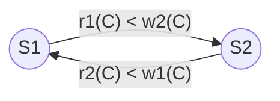

# Concurrency analysis

The heart of the report. Every claim below is backed by a Stepper scenario (`server/src/lab/stepper/scenarios.ts`), a test, or a measured number in [experiments.md](experiments.md). Schema and normalization: [er.md](er.md), [normalization.md](normalization.md).

**Notation.** `A` is one account with `max_streams = 1`. `S1`, `S2` are two claims (transactions) by different devices of `A`. `C` is the *predicate* "active sessions of `A`" (rows with `account_id = A ∧ status = 'PLAYING' ∧ lease_expires_at > now`). `R(x)`/`W(x)` read/write of data item `x`. "Active" always means `PLAYING` with an unexpired lease, judged by the database clock (`NOW(3)`).

**The invariant.** For every account: `|σ_{account_id=A ∧ status='PLAYING' ∧ lease_expires_at>now}(playback_session)| ≤ max_streams(A)`. In relational algebra the count the strategies evaluate is

```
γ_{COUNT(*)} ( σ_{account_id = a ∧ status = 'PLAYING' ∧ lease_expires_at > now ∧ device_id ≠ d} (playback_session) )
```

(the claiming device `d` is excluded because a device's own session never blocks it). The index `ix_session_account_status_lease (account_id, status, lease_expires_at)` answers it with one range scan; that is why `account_id` is deliberately kept in `playback_session` (normalization.md §4).

---

## 1. Why the naive claim is wrong: write skew, not lost update

Each claim does `R(C)` (count), decides, then `W(new row)` (insert). The two inserts go to **different rows**, so no row is ever written twice: this is *write skew* (a phantom-based anomaly), not a lost update. A lost update needs two read-modify-writes of the **same** row (the song `play_count` experiment covers that separately).

### 1.1 The NAIVE schedule and its precedence graph

```
S1: R(C) → 0      S2: R(C) → 0      S1: W(row1)      S2: W(row2)
```

As a schedule over the predicate item `C` (insert into a predicate = write of `C`):

```
r1(C) r2(C) w1(C) w2(C)
```

Conflicting pairs (different transactions, same item, at least one write, ordered by position):

| Pair | Edge |
|---|---|
| `r1(C)` before `w2(C)` | S1 → S2 |
| `r2(C)` before `w1(C)` | S2 → S1 |
| `w1(C)` before `w2(C)` | S1 → S2 |



The graph has a **cycle** (S1 → S2 → S1), so the schedule is **not conflict-serializable**: neither serial order (S1;S2 or S2;S1) lets the second transaction see the first's insert, but here both saw 0. Any correct strategy must forbid this interleaving or force one side to observe the other's write. (The Theory tab in Stats for nerds draws this graph for any schedule you type; `web/src/lib/theory/`, tested with this exact schedule.)

---

## 2. Strategy by strategy

For each strategy: the schedule that matters, isolation, locks taken (as shown by the Stepper's lock table), and what it prevents or allows. All statements run inside `executeClaim` (idempotency wrapper) and `withRetry` (retries 1213, 1205, OCC conflicts with 5→80 ms backoff).

### 2.1 NAIVE (autocommit, no transaction)

1. `S1: SELECT max_streams` · 2. `S2: SELECT max_streams` · 3. `S1: SELECT COUNT(*)` → 0 · 4. `S2: SELECT COUNT(*)` → 0 · 5. (race window: `raceDelayMs` sleep) · 6. `S1: INSERT session` · 7. `S2: INSERT session` · 8. bump `state_version` (each statement commits on its own).

- **Locks:** none on the reads; X record lock only for the duration of each single-statement insert.
- **Allows:** write skew (measured: 100% of trials violate at 64-way; mean 63 excess sessions of 64). Also no atomicity across statements: a failure after the insert leaves the session behind.

### 2.2 TXN_RR (BEGIN…COMMIT at REPEATABLE READ; option READ COMMITTED)

Same statements in one transaction.

- **Locks:** none on the reads (a plain `SELECT` is a non-locking MVCC snapshot read at RR **and** at RC).
- **Prevents:** partial effects (a failed claim rolls back, including the fault-injected `AFTER_SESSION_INSERT`). **Allows:** write skew. ACID's *isolation* does not protect a predicate over a set of rows unless the reads lock. Stepper scenario `RACE_TXN_RR`.

### 2.3 SERIALIZABLE

1. `S1: BEGIN` · 2. `S2: BEGIN` · 3. `S1: SELECT COUNT(*)` (becomes `LOCK IN SHARE MODE`: **S next-key lock** on `ix_session_account_status_lease` plus the supremum gap) · 4. `S2: SELECT COUNT(*)` (also S, compatible) · 5. `S1: INSERT` → needs `X,INSERT_INTENTION` in the gap S2 holds → **waits** · 6. `S2: INSERT` → waits for S1's S lock → **cycle** → InnoDB rolls back one victim (1213).

- **Locks:** `IX` on the table, `S` next-key on the index range, `X,INSERT_INTENTION`.
- **Prevents** the phantom by making the count a locked read. **Cost:** every racing pair deadlocks; the loser retries (measured at 64-way: mean 346.8 deadlocks, 378 of 640 requests exhausting retries, p95 373 ms, 173 rps). Stepper: `SERIALIZABLE_DEADLOCK`.

### 2.4 PESSIMISTIC (strict two-phase locking on one lock target)

1. `S1: BEGIN` (READ COMMITTED) · 2. `S1: SELECT … FROM account WHERE account_id = A FOR UPDATE` → `IX` on `account` + **`X,REC_NOT_GAP`** on the account row · 3. `S2: BEGIN` · 4. `S2: … FOR UPDATE` → **WAITING** (wait edge S2 → S1) · 5. `S1: COUNT` → 0, `INSERT`, bump, event, `COMMIT` (locks released) · 6. `S2` unblocks, `COUNT` → **1** (READ COMMITTED reads fresh), rejects.

- **Strict 2PL:** locks are acquired before the first read of shared state and held to commit; the account row is a per-account mutex, so the *account primary key is the lock target* (locking the empty session range would take gap locks and invite deadlocks).
- **Must be READ COMMITTED with the lock first.** At REPEATABLE READ a plain `SELECT` *before* the lock fixes the snapshot, so a transaction can hold the lock and still count a stale 0 (Stepper `PESSIMISTIC_RR_PITFALL`): locks and MVCC snapshots interact.
- **Prevents** the violation; cost is queueing (measured p95 25.9 ms at c=2 → 97 ms at c=64 on one account; flat, 25→40 ms, across 16 accounts).

### 2.5 OPTIMISTIC (validation by compare-and-set)

1. `S1: BEGIN` (RC); `S1: v = SELECT state_version` → v; `S1: COUNT` → 0 · 2. `S2: BEGIN`; `S2: v = state_version` → v; `COUNT` → 0 · 3. `S1: UPDATE account SET state_version = v+1 WHERE account_id = A AND state_version = v` → **1 row**; INSERT; COMMIT · 4. `S2: same UPDATE` → **0 rows** → conflict → ROLLBACK → retry (now reads the new version and count 1 → rejects).

- **Locks:** none during the read phase; a brief `X,REC_NOT_GAP` on the account row during the CAS (OCC on a locking engine still validates with a short write lock).
- **Correctness argument.** The CAS succeeds only if no operation that bumps the version committed between the read and the validation. Every operation that can increase the active set or change limits/policy bumps `state_version` (claim, resume, takeover/preempt, settings, expire, repair). Operations that only *reduce* the active set without a bump are heartbeat-driven lease lapses (a lapsed lease simply stops counting, because "active" is judged by `NOW(3)`) and heartbeats themselves, which never bump the version **and can never revive an expired lease** (the fence below). So a stale count can only be *too large*, never too small: the worst case is a spurious rejection, never a violation.
- **Cost:** retries grow with contention (63 mean retries at c=64), yet it has the lowest p95 (52 ms) and highest throughput (1189 rps) among the safe strategies there, because a failed CAS is cheaper than waiting in a lock queue.

### 2.6 CONSTRAINT (declarative, via a unique index)

`active_account_id = IF(status = 'PLAYING', account_id, NULL)` (stored generated column) with `UNIQUE INDEX uq_one_active_per_account (active_account_id)`; InnoDB UNIQUE allows any number of NULLs, so the index means "at most one PLAYING row per account".

1. expire this account's lapsed PLAYING rows · 2. (TAKEOVER: preempt) · 3. `INSERT` → the second concurrent insert of the same key **waits** on the first's uncommitted index entry, then fails `ER_DUP_ENTRY 1062` (or succeeds if the first rolled back).

- **Prevents** the violation with the least code, **but only for `max_streams = 1`**: MySQL has no partial or "≤ N" unique index and no SQL `ASSERTION`. The index exists only while this strategy is live (otherwise NAIVE would be silently protected).
- **Lock-order deviation:** it touches `playback_session` before `account` (the version bump comes after the insert), opposite to the reaper's `account → session`, so claim/reaper deadlocks are possible; `withRetry` absorbs them and the lab reports them (p95 degrades to 282 ms at c=64 on 16 accounts).

### 2.7 TRIGGER (Phase 7)

A `BEFORE INSERT` trigger counts active sessions and `SIGNAL SQLSTATE '45000'` at the limit; the application does no count at all. Measured: a `SELECT` inside a trigger runs with the *locking* semantics of the invoking `INSERT` (the second insert blocked on the first's uncommitted row in a manual two-connection test), so the trigger closes almost the whole window. What remains is the instant before either row exists: at READ COMMITTED there are no gap locks, so two triggers that both count first both pass. Result: mostly safe, not guaranteed (10% of trials violate at 64-way on one account; 70% spread over 16 accounts), with deadlocks. See [experiments.md](experiments.md).

### 2.8 REDIS_LEASE (Phase 7)

The limit is enforced by one atomic Lua script in Redis (`SET slot NX PX <lease>` over `max_streams` slot keys) *before* MySQL records the session. Correctness comes from an atomic primitive, so it never violates and is the fastest; but two stores can disagree (TAKEOVER needs a reconciliation step; a crash between "won the slot" and "inserted the session" leaks the slot until its TTL, so the claim frees it on error), and one Redis node is not partition-tolerant as a lock service (the claim fails closed).

---

## 3. Leases and fencing (why heartbeats alone are not enough)

A session holds a lease. The heartbeat is

```sql
UPDATE playback_session SET lease_expires_at = NOW(3) + INTERVAL (? * 1000) MICROSECOND, position_ms = ?
WHERE session_id = ? AND device_id = ? AND status = 'PLAYING' AND lease_expires_at > NOW(3);
```

The `WHERE` clause is a **fence**: an expired or preempted session cannot be extended, so a "zombie" device (a laptop waking from sleep) is refused with HTTP 410 and must stop, and the active count can only fall over time without a version bump. Clock skew never matters because every comparison happens in SQL with one clock.

## 4. The lock-order rule (deadlock *prevention* by resource ordering)

Every correct path acquires **`account → device → playback_session → playback_event`**. Stepper `CLASSIC_DEADLOCK` (T1 locks account A then B, T2 locks B then A) deadlocks; `ORDERED_LOCKING` (both lock the lower id first) cannot. InnoDB additionally does deadlock **detection** (a wait-for graph; it picks a victim almost immediately, errno 1213). CONSTRAINT is the one documented violation of the order (§2.6).

## 5. Multi-granularity locking

`data_locks` shows `IX` on the table alongside record locks (`X,REC_NOT_GAP`, `S`/`X` next-key, `X,GAP`, `X,INSERT_INTENTION`). Foreign-key checks take `S,REC_NOT_GAP` on parent rows (`device`, `song`), which is part of why the append-only audit log has no FKs (so appending never takes locks on parents). The index experiment (below) shows the footprint effect.

## 6. Indexes change the lock footprint (H6)

The composite index does not just make the count fast; it limits **which rows InnoDB locks**. Measured by the Index experiment (`lab/indexExperiment.ts`): one account's expire `UPDATE` holds **5** locks with `ix_session_account_status_lease`, and about **20,600** without it, and without it an identical `UPDATE` for a *different* account is blocked (lock wait timeout). InnoDB locks every index record it scans. The related bench observation (SERIALIZABLE worse at 16 accounts than at 1: p95 364.7 vs 120.38 ms at c=32) is the same mechanism seen from the strategy side: next-key locks extend into the gap toward the *next* distinct key, so one account's phantom-protection range abuts a neighbouring account's inserts on the same physical index.

## 7. Recovery

InnoDB uses undo and redo logging with write-ahead logging (**immediate update**): an uncommitted transaction's changes are rolled back from the **undo log** (Stepper `KILL_RECOVERY`: `KILL <conn_id>` → locks vanish, the uncommitted row is gone, the other transaction proceeds; and the `AFTER_SESSION_INSERT` fault-injection test leaves no session or event row), while committed changes survive a crash by replaying the **redo log**. Contrast for the report: *deferred update* (changes applied to the database only at commit; no undo needed, redo only) and *shadow paging* (copy-on-write page table; no logs, but fragmentation and poor concurrency).

## 8. Where the numbers are

Table A (harshest cell), Tables B/C (latency by concurrency, 1 vs 16 accounts), Table D (lost update), hypotheses H1–H6 with their results, and the Phase 7 strategies: [experiments.md](experiments.md). Raw per-trial CSVs: `docs/results/`.
