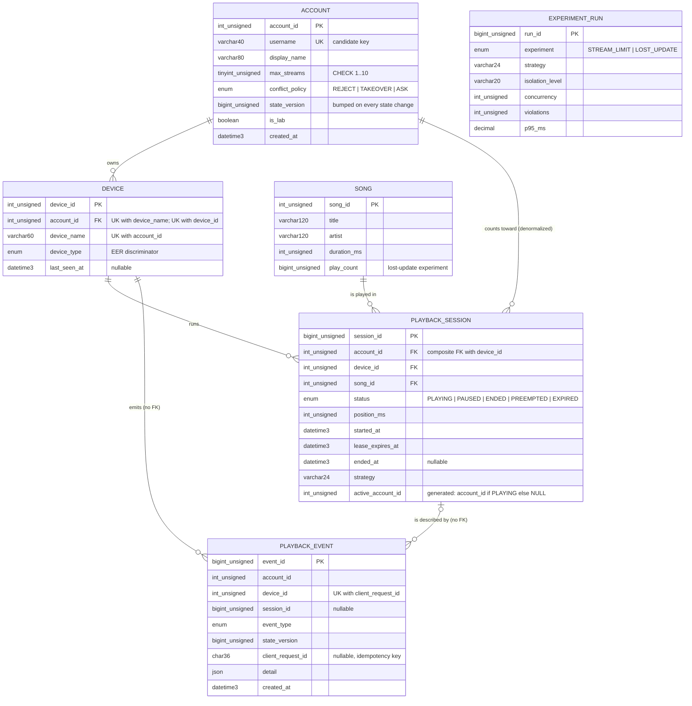
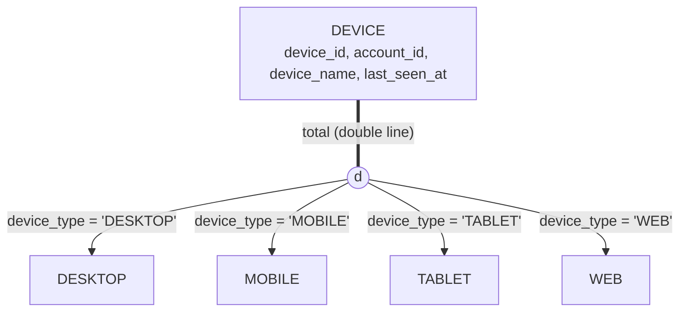

# ER / EER model

Conceptual model behind [`db/schema.sql`](../db/schema.sql). Normal-form analysis is in [normalization.md](normalization.md).

## 1. ER diagram

`EXPERIMENT_RUN` stands alone: it stores results about the lab, not facts about accounts, so it has no relationships. Only its main columns are shown.

## 2. Relationships, cardinality and participation

| Relationship | Cardinality | Participation | Mapped as |
|---|---|---|---|
| ACCOUNT *owns* DEVICE | 1 : N | DEVICE total (every device has an owner), ACCOUNT partial | FK `device.account_id → account`, `ON DELETE CASCADE` |
| DEVICE *runs* PLAYBACK_SESSION | 1 : N | SESSION total, DEVICE partial | Part of composite FK `(device_id, account_id) → device(device_id, account_id)` |
| SONG *is played in* PLAYBACK_SESSION | 1 : N | SESSION total, SONG partial | FK `playback_session.song_id → song` |
| ACCOUNT *counts toward* PLAYBACK_SESSION | 1 : N | derived | Not a separate relationship. `account_id` is copied from the device and kept consistent by the composite FK (see normalization.md §4) |
| PLAYBACK_SESSION *is described by* PLAYBACK_EVENT | 1 : N | EVENT partial (some events, e.g. a rejected claim, have no session) | Plain columns, **no FK** on purpose |

Session deletion is `RESTRICT` (the FK default), so a device or song that has sessions can't be deleted. Session history is kept. Deleting an account cascades to its devices, which is then blocked if any of those devices have sessions. For a coursework system that is the intended behaviour: history is never silently lost.

## 3. Modelling notes

**PLAYBACK_SESSION is a reified relationship.** Conceptually it is the M:N relationship "DEVICE plays SONG" with its own attributes (status, position, lease). One device can play the same song many times, so `(device_id, song_id)` can't identify a session. It is promoted to an entity with a surrogate key `session_id`.

**PLAYBACK_EVENT and aggregation.** An event is about a particular *session*, and a session is itself the device–plays–song relationship. In EER terms, the event relates to that relationship treated as a higher-level entity, which is aggregation. Events can also exist without a session (`CLAIM_REJECTED`), so participation on the session side is partial and `session_id` is nullable.

**Why the audit log has no foreign keys.** An audit log should survive deletes of the rows it describes, and appending to it should never block on, or take locks on, parent rows. With FKs, every event insert would take an `S,REC_NOT_GAP` lock on the parent device and session rows. The trade-off is that the DB doesn't guarantee referential integrity for events. The application writes them in the same transaction as the change they describe.

**DEVICE as a weak entity (the road not taken).** A device is naturally identified by its owner plus its name, `(account, device_name)`, which is a partial key. That makes DEVICE a candidate weak entity, with ACCOUNT as its identifying owner. We give it a surrogate key `device_id` instead (short FK in sessions and events, stable if a device is renamed) and keep `(account_id, device_name)` as a declared candidate key, `uq_device_account_name`.

**Generated column relies on NULL semantics.** `active_account_id` is `account_id` while the session is `PLAYING` and `NULL` otherwise. InnoDB UNIQUE indexes allow any number of NULLs, so the optional index `uq_one_active_per_account` means "at most one PLAYING row per account". This is a declarative encoding of `max_streams = 1` and is not created by default. It can't express "≤ N" (PLAN.md §2 item 7).

## 4. EER: specialization of DEVICE

| Property | Value | Enforced by |
|---|---|---|
| Disjointness | **Disjoint (d)**: a device is exactly one kind | `device_type` is a single-valued ENUM |
| Completeness | **Total**: every device belongs to a subclass | `device_type ... NOT NULL` |
| Definition | **Attribute-defined** on the defining attribute `device_type` | Subclass membership is decided by that column's value, not by a user |

### Mapping choice

Standard options for mapping a specialization to relations (Elmasri & Navathe, options 8A–8D):

| Option | Relations produced | Fits here? |
|---|---|---|
| **8A** Superclass plus one relation per subclass | `DEVICE(device_id, …)`, `MOBILE(device_id → DEVICE, …)`, … | Works for any specialization. Would be empty tables here, since the subclasses have no specific attributes, and every "what kind is it?" query would need 4 joins. |
| **8B** Subclass relations only | `DESKTOP(device_id, account_id, …)`, `MOBILE(…)`, … | Only valid for total + disjoint (which we are), but uniqueness of `device_name` per account and FKs *to* a device would have to span 4 tables. Rejected. |
| **8C** Single relation with one type attribute ✔ | `DEVICE(…, device_type)` | **Chosen.** Disjoint specialization, no subclass-specific attributes, so no NULL waste. The ENUM enforces disjointness and NOT NULL enforces totality. |
| **8D** Single relation with a Boolean flag per subclass | `DEVICE(…, is_desktop, is_mobile, …)` | Meant for *overlapping* specializations. Would allow illegal combinations (two flags true) without extra CHECKs. |

If subclass-specific attributes appear later (say `os_version` for MOBILE only), 8C would start producing mostly-NULL columns, and 8A would become the better choice.
