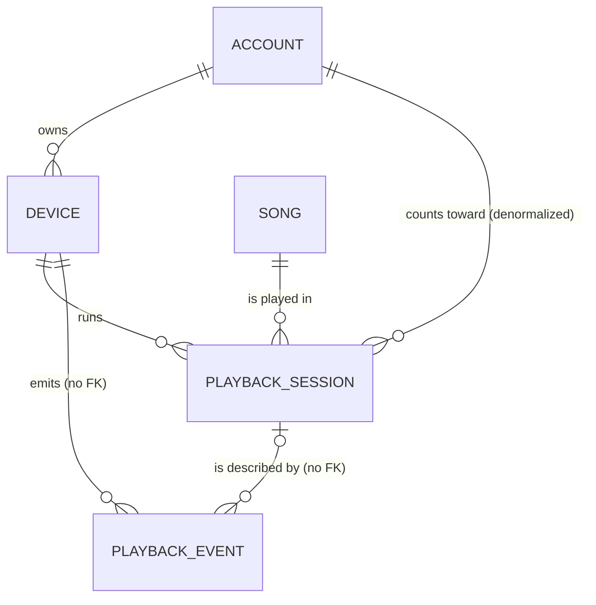

# Project Proposal & Database Design Document

| | |
|---|---|
| **Course** | Database Management Systems |
| **Instructor** | _<instructor>_ |
| **Date** | 25 September 2026 |
| **Repository** | `playsync/` (MySQL 8.4 + Node.js + React) |

### Contributors

| S. No. | Reg. No. | Name |
|---|---|---|
| 1 | 24BCE0043 | Akshat Raj |
| 2 | 24BCE2878 | Mohit Kumar |
| 3 | 24BCE2877 | Vishal Vivek |

---

## 1. Project Title

**PlaySync: Keeping Many Devices in Agreement — Enforcing a Per-Account Stream Limit with Relational Concurrency Control**

*Subtitle:* A multi-device music playback coordinator built on MySQL/InnoDB, used as a laboratory for comparing transaction isolation levels, locking and optimistic strategies.

---

## 2. Introduction and Background

Music and video streaming services let one account be signed in on many devices (phone, laptop, tablet, browser) but limit how many of them can **play at the same time**. When a second device presses Play, the app must either refuse, ask "Play here instead?", or move the music across. Every device must then agree, in real time, on which one is playing.

Behind this simple behaviour is a classic database problem. Several devices read the same shared state ("how many streams are active on this account?") and then write based on what they read. If two devices do this at the same instant, both can see "nobody is playing" and both can start. The account ends up over its limit. This is the **write skew / phantom** anomaly studied in the transactions and concurrency-control part of a DBMS course.

PlaySync is a working multi-device player that turns this real-world scenario into a measurable experiment. The same "press Play" operation is implemented with six different concurrency-control strategies:

- no protection;
- a plain transaction;
- the SERIALIZABLE isolation level;
- pessimistic row locking;
- optimistic version checks;
- a declarative unique constraint.

The database itself then reports which strategies keep the rule and what each one costs.

---

## 3. Problem Statement

> **For every account, the number of sessions that are playing and whose lease has not expired must never exceed that account's `max_streams`.**

This rule (the *invariant*) concerns a **set of rows**, not a single row. A primary key or ordinary constraint cannot protect it on its own. Under MySQL's default isolation (REPEATABLE READ), wrapping the check-then-insert in a transaction is *not enough*: plain `SELECT`s are non-locking snapshot reads.

The system must also deal with four real-world failure modes:

1. **Simultaneous presses.** Tens of devices press Play in the same millisecond.
2. **Devices that disappear.** A laptop lid closes and the phone loses Wi-Fi, so their stream slots must eventually be released.
3. **"Zombie" devices.** A device that was taken over, or that slept past its lease, wakes up and must *not* resume playing.
4. **Lost updates.** Many listeners finish a song at once, and every play must be counted in the song's play counter.

**The problem solved:** how can a relational DBMS maintain a correct, real-time, shared view of concurrent playback across devices? And what are the correctness and performance trade-offs of different concurrency-control techniques for enforcing it?

---

## 4. Objectives

1. **Design a normalized relational schema** for accounts, devices, songs, playback sessions, an audit log and experiment results. Identify keys, functional dependencies and normal forms, and justify the one deliberate denormalization.
2. **Enforce the stream-limit invariant** correctly under heavy concurrency using transactions, isolation levels and locks. Prove it with automated tests (0 violations over repeated 50-way races).
3. **Demonstrate the anomalies** that the unsafe approaches allow:
   - write skew / phantoms (NAIVE, plain transaction at REPEATABLE READ);
   - lost updates (read-modify-write counter).

   Each is shown with real numbers from the database.
4. **Implement leases and fencing.** Sessions hold time-limited leases, refreshed by heartbeats. Expired or taken-over sessions can never be revived, and all time comparisons use the database clock (`NOW(3)`).
5. **Measure and compare six strategies** on violations, retries, deadlocks, lock-wait timeouts, latency (p50/p95) and throughput. Store every run in the database for analysis.
6. **Make locking visible.** A Transaction Stepper runs two real transactions one statement at a time and shows InnoDB's live lock table, the wait-for graph, deadlock detection and rollback after `KILL`.
7. **Provide a friendly real-time interface** that a non-technical user can understand, plus a "Stats for nerds" view exposing the SQL-level truth.

---

## 5. Scope of the Project

### Included

| Area | Included |
|---|---|
| Data | Accounts, devices (with a device-type specialization), songs, playback sessions, audit events, experiment runs |
| Operations | Claim (Play), pause/resume, release (Stop), heartbeat, take over, go offline / come back, end all sessions, change stream limit and conflict policy |
| Concurrency | 6 claim strategies; isolation levels READ COMMITTED, REPEATABLE READ, SERIALIZABLE; row locks (`FOR UPDATE`); optimistic versioning; unique-index constraint; retry on deadlock (1213) and lock-wait timeout (1205); idempotent requests |
| Recovery | Leases, heartbeats, a lease reaper, fencing of stale devices; atomic rollback on injected failure; `KILL` and undo-log recovery shown in the Stepper |
| Experiments | Stream-limit race lab, lost-update lab, Transaction Stepper (8 scenarios), live Simulation of many households |
| Interface | Web UI (React) usable on a laptop and a real phone over the LAN; real-time updates over WebSockets |
| Analysis | Correctness checks (SQL assertions re-run after every change), per-run metrics, charts, a CLI benchmark |

### Excluded

- User authentication and payments (an account is chosen by username).
- Real audio streaming or a music catalogue service (songs are metadata; playback position is simulated).
- Distributed or replicated databases, sharding, cloud deployment.
- An ORM. All SQL is hand-written so the exact locking statements stay visible.
- Timestamp-ordering / Thomas write-rule protocols. MySQL does not implement them; they are only mentioned for comparison.

---

## 6. Requirement Analysis

### 6.1 Users of the system

| User | Needs |
|---|---|
| **Listener** (non-technical) | Play music on any of their devices; be told clearly when another device is already playing; move playback between devices |
| **Demonstrator / student** | Run concurrency experiments, compare strategies, change conditions live (Simulation), show the results |
| **Instructor / examiner (technical)** | Inspect the SQL, locks, audit trail, invariant checks and stored experiment results |
| **Automated tests and benchmark** | Hammer the database with concurrent requests and verify the invariant |

### 6.2 Data to be stored

| Data | Examples |
|---|---|
| Accounts | username, display name, **max_streams**, conflict policy (REJECT / TAKEOVER / ASK), state version |
| Devices | name, type (desktop / mobile / tablet / web), owner account, last seen time |
| Songs | title, artist, duration, play count |
| Playback sessions | which device plays which song, status (PLAYING / PAUSED / ENDED / PREEMPTED / EXPIRED), position, start time, **lease expiry**, end time, strategy used |
| Audit events | every grant, rejection, preemption, pause, release, expiry and rejected heartbeat, with the account's state version and an idempotency key |
| Experiment runs | strategy, isolation, concurrency, limit, delay, and the measured granted / rejected / retries / deadlocks / timeouts / violations / latency / throughput, grouped into batches |

### 6.3 Operations to be performed

| Operation | Type | Key concurrency concern |
|---|---|---|
| Claim a stream (Play) | Read-check-insert transaction | Write skew between simultaneous claims |
| Take over | Preempt oldest session(s), then insert | Consistent choice of victims; lock ordering |
| Heartbeat | Fenced `UPDATE … WHERE status='PLAYING' AND lease_expires_at > NOW(3)` | A stale device must never revive a session |
| Pause / resume / release | Account-locked transaction | Lost-update-free state transitions |
| Expire leases (reaper) | Periodic transaction per account | Must not fight with claims (global lock order) |
| Change settings | Locked update with validation | Cannot lower the limit below the current active count |
| Increment play count | Counter update | Lost update (4 variants compared) |
| Run experiments | Many parallel connections behind a barrier | Real races on real rows |

### 6.4 Information to be retrieved or analysed

- **Live account state:** which devices are playing, lease time remaining, current state version. This is pushed to every device after each commit.
- **Invariant check** (the ground-truth query):

```sql
SELECT a.account_id, a.max_streams, COUNT(*) AS active
FROM account a
JOIN playback_session s
  ON s.account_id = a.account_id
 AND s.status = 'PLAYING' AND s.lease_expires_at > NOW(3)
GROUP BY a.account_id, a.max_streams
HAVING COUNT(*) > a.max_streams;      -- any row here is a violation
```

- **Six correctness checks** re-run after every change: no over-limit account, no expired-but-PLAYING rows left behind, session/device/account consistency, and others.
- **Audit timeline** per account (`ix_event_account_time`).
- **Experiment analysis:** violations and cost per strategy, latency percentiles, throughput, charts over concurrency. All are read from `experiment_run`.
- **InnoDB internals:** `performance_schema.data_locks`, `data_lock_waits`, and `SHOW ENGINE INNODB STATUS` for deadlock reports.

### 6.5 Non-functional requirements

- **Correctness first.** Safe strategies must show **0 violations** in every trial.
- **Real-time.** Every device learns about a change right after it commits (WebSockets). Nothing is published from inside a transaction.
- **Single clock.** All lease and time comparisons happen in SQL with `NOW(3)`.
- **Reproducibility.** Everything runs locally for free (Docker MySQL, Node, React), and all runs are persisted.

---

## 7. Database Selection and Justification

| | |
|---|---|
| **Technology** | **MySQL 8.4 Community Edition** with the **InnoDB** storage engine (run in Docker) |
| **Type of database** | **Relational** (SQL, ACID transactions) |

**Why a relational database, and why MySQL/InnoDB in particular:**

1. **The problem is a transactions problem.** The core rule spans several rows and must hold under concurrency. Relational DBMSs provide the tools the project is about: ACID transactions, isolation levels, row and gap locks, deadlock detection, and constraints.
2. **InnoDB exposes its internals.** `performance_schema.data_locks` and `data_lock_waits` show every lock held and awaited, and `SHOW ENGINE INNODB STATUS` prints the latest deadlock. The Transaction Stepper visualizes these, which few other systems allow as directly.
3. **Its default behaviour is instructive.** At REPEATABLE READ, InnoDB uses MVCC snapshot reads, so a naive transaction still allows write skew. At SERIALIZABLE, it converts reads to shared next-key locks, which prevents the anomaly but causes deadlocks. Both effects are observable, and both are core syllabus topics.
4. **Strong structural integrity.** The data is naturally tabular and strongly related (account → devices → sessions), so foreign keys, composite keys, CHECK constraints and generated columns keep it consistent. A composite foreign key is what makes the deliberate denormalization safe (§8.6).
5. **Declarative constraint trick.** A stored generated column plus a UNIQUE index expresses "at most one PLAYING session per account". This gives a sixth, purely declarative strategy, and its limitation (it cannot express "≤ N") is itself a finding.
6. **Free and local.** No licence, cloud account or API keys are needed.

**Why not the alternatives:**

| Option | Reason not chosen |
|---|---|
| Document DB (e.g. MongoDB) | The invariant spans many documents; multi-document transactions exist but the locking model is opaque and would hide exactly what the project studies |
| Key-value (e.g. Redis) | Excellent for leases and counters, but it has no relational integrity or isolation levels to compare. It was noted as an optional comparison only. |
| Graph DB | The data is not graph-shaped; relationships are simple 1:N hierarchies |
| Cloud DB | Adds cost and network latency noise to latency measurements |

---

## 8. Data Model / Database Design (Relational)

### 8.1 Entities and attributes

| Entity | Attributes (PK underlined, candidate keys marked) | Description |
|---|---|---|
| **ACCOUNT** | <u>account_id</u>, username *(UK)*, display_name, max_streams, conflict_policy, state_version, is_lab, created_at | One subscription; owns devices and sets the stream limit |
| **DEVICE** | <u>device_id</u>, account_id *(FK)*, device_name, device_type, last_seen_at; (account_id, device_name) *(UK)* | A phone, laptop, tablet or browser signed in to an account |
| **SONG** | <u>song_id</u>, title, artist, duration_ms, play_count | Catalogue entry; `play_count` is the lost-update target |
| **PLAYBACK_SESSION** | <u>session_id</u>, account_id, device_id, song_id, status, position_ms, started_at, lease_expires_at, ended_at, strategy, active_account_id *(generated)* | One period of a device playing a song; its lease makes it "active" |
| **PLAYBACK_EVENT** | <u>event_id</u>, account_id, device_id, session_id, event_type, state_version, client_request_id, detail (JSON), created_at | Append-only audit log of every state change and rejection |
| **EXPERIMENT_RUN** | <u>run_id</u>, experiment, strategy, isolation_level, mode, concurrency, accounts, max_streams, race_delay_ms, granted, rejected, retries, deadlocks, lock_timeouts, errors, violations, p50_ms, p95_ms, throughput_rps, wall_ms, batch_id, trial, source, detail (JSON), created_at | One measured trial of an experiment |

### 8.2 ER diagram

```
                 ┌───────────────────┐
                 │      ACCOUNT      │
                 │ PK account_id     │
                 │ UK username       │
                 │    max_streams    │
                 │    conflict_policy│
                 │    state_version  │
                 └─────────┬─────────┘
                           │ 1
                      owns │            (total participation of DEVICE)
                           │ N
                 ┌─────────┴─────────┐                 ┌──────────────────┐
                 │      DEVICE       │                 │       SONG       │
                 │ PK device_id      │                 │ PK song_id       │
                 │ FK account_id     │                 │    title, artist │
                 │    device_name    │                 │    duration_ms   │
                 │    device_type ◄──┼── EER: d, total │    play_count    │
                 └─────────┬─────────┘                 └────────┬─────────┘
                           │ 1                                  │ 1
                      runs │                    is played in    │
                           │ N                                  │ N
                 ┌─────────┴────────────────────────────────────┴─────────┐
                 │                  PLAYBACK_SESSION                       │
                 │  (reified M:N "DEVICE plays SONG" with its own attrs)   │
                 │ PK session_id   FK (device_id, account_id)  FK song_id  │
                 │    status, position_ms, started_at, lease_expires_at,   │
                 │    ended_at, strategy, active_account_id (generated)    │
                 └─────────────────────────────┬───────────────────────────┘
                                               │ 1   (partial: rejected claims
                                is described by│      have no session)
                                               │ N   — no FK on purpose
                 ┌─────────────────────────────┴───────────────────────────┐
                 │                   PLAYBACK_EVENT (audit)                 │
                 │ PK event_id  UK (device_id, client_request_id)          │
                 └─────────────────────────────────────────────────────────┘

                 ┌───────────────────┐
                 │  EXPERIMENT_RUN   │   stand-alone: facts about the lab,
                 │ PK run_id         │   not about accounts (no relationships)
                 └───────────────────┘
```

Mermaid version (renders on GitHub and in many Markdown viewers):



**EER specialization of DEVICE.** DEVICE is specialized into DESKTOP, MOBILE, TABLET and WEB:

- **disjoint:** a device is exactly one kind;
- **total:** every device has a kind;
- **attribute-defined:** the subclass is given by `device_type`.

The subclasses have no attributes of their own, so it is mapped with a **single relation plus a type attribute** (Elmasri & Navathe option 8C). An ENUM enforces disjointness and NOT NULL enforces totality.

**Modelling notes:**
- PLAYBACK_SESSION is the **reified M:N relationship** "DEVICE plays SONG". The same device can play the same song many times, so it gets a surrogate key.
- PLAYBACK_EVENT relates to that relationship as an aggregated entity. Participation is partial, since a rejected claim has no session.
- DEVICE could have been a **weak entity** of ACCOUNT, identified by (account, device_name). A surrogate key was chosen instead, and (account_id, device_name) is kept as a declared candidate key.

### 8.3 Relationships

| Relationship | Cardinality | Participation | Implementation |
|---|---|---|---|
| ACCOUNT *owns* DEVICE | 1 : N | DEVICE total, ACCOUNT partial | FK `device.account_id → account`, `ON DELETE CASCADE` |
| DEVICE *runs* PLAYBACK_SESSION | 1 : N | SESSION total | Composite FK `(device_id, account_id) → device(device_id, account_id)` |
| SONG *is played in* PLAYBACK_SESSION | 1 : N | SESSION total | FK `song_id → song`, `RESTRICT` |
| PLAYBACK_SESSION *is described by* PLAYBACK_EVENT | 1 : N | EVENT partial | Plain columns, **no FK** (an audit log must survive deletes and must not take locks on parent rows) |

### 8.4 Relational schema

Primary keys, foreign keys and unique keys are listed under each relation.

```
ACCOUNT (account_id, username, display_name, max_streams, conflict_policy,
         state_version, is_lab, created_at)
  PK  account_id
  UK  username

DEVICE (device_id, account_id, device_name, device_type, last_seen_at)
  PK  device_id
  FK  account_id → ACCOUNT(account_id)  ON DELETE CASCADE
  UK  (account_id, device_name)          -- candidate key
  UK  (device_id, account_id)            -- target of the composite FK below

SONG (song_id, title, artist, duration_ms, play_count)
  PK  song_id

PLAYBACK_SESSION (session_id, account_id, device_id, song_id, status, position_ms,
                  started_at, lease_expires_at, ended_at, strategy, active_account_id)
  PK  session_id
  FK  (device_id, account_id) → DEVICE(device_id, account_id)
  FK  song_id → SONG(song_id)
  active_account_id = IF(status='PLAYING', account_id, NULL)  STORED GENERATED

PLAYBACK_EVENT (event_id, account_id, device_id, session_id, event_type,
                state_version, client_request_id, detail, created_at)
  PK  event_id
  UK  (device_id, client_request_id)     -- idempotency of client retries

EXPERIMENT_RUN (run_id, experiment, strategy, isolation_level, mode, concurrency,
                accounts, max_streams, race_delay_ms, granted, rejected, retries,
                deadlocks, lock_timeouts, errors, violations, p50_ms, p95_ms,
                throughput_rps, wall_ms, batch_id, trial, source, detail, created_at)
  PK  run_id
```

Representative DDL (full script: `db/schema.sql`):

```sql
CREATE TABLE playback_session (
  session_id        BIGINT UNSIGNED AUTO_INCREMENT PRIMARY KEY,
  account_id        INT UNSIGNED NOT NULL,     -- deliberate denormalization
  device_id         INT UNSIGNED NOT NULL,
  song_id           INT UNSIGNED NOT NULL,
  status            ENUM('PLAYING','PAUSED','ENDED','PREEMPTED','EXPIRED') NOT NULL,
  position_ms       INT UNSIGNED NOT NULL DEFAULT 0,
  started_at        DATETIME(3) NOT NULL DEFAULT CURRENT_TIMESTAMP(3),
  lease_expires_at  DATETIME(3) NOT NULL,
  ended_at          DATETIME(3) NULL,
  strategy          VARCHAR(24) NOT NULL,
  active_account_id INT UNSIGNED
    GENERATED ALWAYS AS (IF(status = 'PLAYING', account_id, NULL)) STORED,
  CONSTRAINT fk_session_device_account FOREIGN KEY (device_id, account_id)
    REFERENCES device(device_id, account_id),
  CONSTRAINT fk_session_song FOREIGN KEY (song_id) REFERENCES song(song_id),
  INDEX ix_session_account_status_lease (account_id, status, lease_expires_at),
  INDEX ix_session_status_lease (status, lease_expires_at)
) ENGINE=InnoDB;
```

### 8.5 Keys and constraints

| Constraint | Table | Purpose |
|---|---|---|
| Surrogate primary keys (AUTO_INCREMENT) | all | Stable, compact identifiers; short foreign keys |
| `uq_account_username` | account | Candidate key; lookup by username |
| `ck_account_max_streams CHECK (1..10)` | account | Domain constraint on the limit |
| ENUMs (`conflict_policy`, `device_type`, `status`, `event_type`, `experiment`, `source`) | several | Domain integrity; the EER discriminator |
| `uq_device_account_name` | device | Candidate key: no two devices with the same name on one account |
| `fk_device_account … ON DELETE CASCADE` | device | Devices belong to an account |
| **`fk_session_device_account` (composite)** | playback_session | Guarantees the copied `account_id` matches the device's real owner |
| `fk_session_song` | playback_session | A session plays an existing song |
| `uq_event_request (device_id, client_request_id)` | playback_event | **Idempotency:** a retried or double-clicked request is answered once |
| Optional `uq_one_active_per_account (active_account_id)` | playback_session | Declarative "one PLAYING session per account" (added only for the CONSTRAINT strategy) |
| Indexes `ix_session_account_status_lease`, `ix_session_status_lease`, `ix_event_account_time`, `ix_run_batch` | several | Index-range count of active sessions per account; reaper scans; audit timeline; batch lookup |

**The invariant itself** (active ≤ max_streams across rows) cannot be written as a MySQL constraint: MySQL has no `CREATE ASSERTION` and no partial indexes. It is enforced by **concurrency control** inside the claim transaction and verified by the check queries.

### 8.6 Normalization

Every table has a single-attribute surrogate primary key, so partial dependencies on the PK cannot occur. 2NF therefore reduces to checking composite candidate keys.

| Table | Functional dependencies | Candidate keys | Normal form |
|---|---|---|---|
| ACCOUNT | account_id → all; username → account_id | {account_id}, {username} | **BCNF** |
| DEVICE | device_id → all; {account_id, device_name} → device_id | {device_id}, {account_id, device_name} | **BCNF** |
| SONG | song_id → all ({title, artist} is *not* a key: remasters and live versions) | {song_id} | **BCNF** |
| PLAYBACK_SESSION | session_id → all; **device_id → account_id**; {status, account_id} → active_account_id | {session_id} | **2NF (deliberately not 3NF)** |
| PLAYBACK_EVENT | event_id → all; device_id → account_id (via device) | {event_id} (+ {device_id, client_request_id} for non-NULL ids) | **2NF**, append-only |
| EXPERIMENT_RUN | run_id → all (configuration columns repeat across trials, so they are not a key) | {run_id} | **BCNF** |

**The deliberate 3NF violation.** In `playback_session`, `session_id → device_id → account_id` is a transitive dependency. The textbook fix is to drop `account_id` from the session and reach it through `device`. That decomposition is lossless and dependency-preserving.

It is **kept on purpose** because the whole project revolves around the per-account count of active sessions:

1. The index `(account_id, status, lease_expires_at)` answers that count with a single index range scan, with no join.
2. Under SERIALIZABLE and locking reads, InnoDB locks exactly that account's slice of the index. A join would lock more rows and cause more blocking and deadlocks.
3. The declarative UNIQUE-index strategy needs `account_id` in the session row, because an index cannot span two tables.

**Controlling the anomaly.** The **composite foreign key** `(device_id, account_id) → device(device_id, account_id)` makes it impossible to insert or update a session whose `account_id` disagrees with its device's owner. The database rejects it with error 1452, and a schema test shows this. The generated column cannot drift either, since InnoDB computes it.

`PLAYBACK_EVENT` is append-only: rows are never updated, so the update anomaly 3NF guards against cannot occur.

**1NF note:** the `detail` JSON columns hold opaque payloads that are never filtered or joined on. If a field inside one ever became query-relevant, it would be promoted to a column.

(Full analysis with proofs: `docs/normalization.md`; ER/EER details: `docs/er.md`.)

### 8.7 Transaction design (how the invariant is protected)

| Strategy | Isolation / technique | Outcome |
|---|---|---|
| NAIVE | Autocommit: `COUNT`, then `INSERT` | **Violates** (write skew) |
| TXN_RR | `BEGIN … COMMIT` at REPEATABLE READ | **Violates**: snapshot reads don't lock |
| SERIALIZABLE | Reads become shared next-key locks | Correct; deadlocks (1213) and retries |
| PESSIMISTIC | READ COMMITTED + `SELECT … FROM account WHERE account_id=? FOR UPDATE` first | Correct; the account row is a per-account mutex |
| OPTIMISTIC | Check, then `UPDATE account SET state_version=v+1 WHERE state_version=v` (compare-and-set) | Correct; retry on conflict |
| CONSTRAINT | Generated column + UNIQUE index; duplicate-key error = "someone is playing" | Correct only for `max_streams = 1` |

All correct code paths follow one **global lock order**, `account → device → playback_session → playback_event`, to avoid deadlocks between different operations. Real-time notifications are sent **only after COMMIT**, which avoids an application-level dirty read. Every state change increments `account.state_version`, which serves both for optimistic checks and for clients discarding out-of-order messages.

---

## 9. System Architecture / Workflow Diagram

### 9.1 High-level architecture

```
 ┌───────────────────────────── USERS ─────────────────────────────┐
 │  Listener on a real phone   Listener on laptop/tablet/browser   │
 │  Demonstrator (Stress test, Simulation)   Examiner (Nerds view) │
 └──────────────┬──────────────────────────────────┬───────────────┘
                │ HTTPS/HTTP (REST: Play, Pause,   │ WebSocket (socket.io):
                │  Stop, Heartbeat, Settings, Lab) │  live account state,
                ▼                                  │  "your session was lost"
 ┌─────────────────────────── APPLICATION ─────────┴───────────────┐
 │  React + Vite web client (friendly pages + Stats for nerds)     │
 │                         │                                       │
 │  Node.js / TypeScript API (Express + zod validation)            │
 │   ├─ Playback service: claim / heartbeat / pause / release      │
 │   ├─ 6 pluggable claim strategies  (raw parameterized SQL)      │
 │   ├─ Transaction helper: isolation level, retry on 1213 / 1205  │
 │   ├─ Lease reaper (expires lapsed sessions every 2 s)           │
 │   ├─ Concurrency Lab, Transaction Stepper, Simulation engine    │
 │   └─ Publisher: pushes changes to devices ONLY AFTER COMMIT     │
 └──────────────┬──────────────────────────────────────────────────┘
                │ mysql2 connection pools (app pool, lab pool)
                ▼
 ┌─────────────────────────── DATABASE ────────────────────────────┐
 │  MySQL 8.4 / InnoDB (Docker)                                    │
 │   account · device · song · playback_session · playback_event · │
 │   experiment_run                                                │
 │   MVCC snapshots · row / gap / next-key locks · deadlock        │
 │   detection · undo log · performance_schema.data_locks          │
 └──────────────┬──────────────────────────────────────────────────┘
                ▼
 ┌─────────────────────────── OUTPUT ──────────────────────────────┐
 │  • Every device shows who is playing ("Playing on iPhone")      │
 │  • Friendly verdicts: "Only 1 screen got in, exactly as allowed"│
 │  • Invariant checks, audit log, lock tables, deadlock reports   │
 │  • Stored experiment results → charts, CSVs, experiments.md     │
 └─────────────────────────────────────────────────────────────────┘
```

### 9.2 Workflow: pressing Play on a second device (PESSIMISTIC strategy)

```
Device B                  API server                              MySQL / InnoDB
   │  POST /claim  ───────►│
   │                       │ SET TRANSACTION ISOLATION LEVEL READ COMMITTED; BEGIN
   │                       │ SELECT … FROM account WHERE account_id=? FOR UPDATE ─► X-lock on account row
   │                       │ SELECT COUNT(*) active sessions ─────────────────────► 1 active (Device A)
   │                       │ policy?
   │                       │  ├─ REJECT  → INSERT event CLAIM_REJECTED; COMMIT
   │                       │  ├─ ASK     → reply "Play here instead?" (client resends as TAKEOVER)
   │                       │  └─ TAKEOVER→ UPDATE A's session = PREEMPTED
   │                       │              INSERT new session (lease = NOW(3)+15 s)
   │                       │              UPDATE account.state_version = +1
   │                       │              INSERT events; COMMIT ──────────────────► locks released
   │  ◄── 200 GRANTED ─────│
   │                       │ AFTER COMMIT: push new state to account room;
Device A ◄── "session_lost: PREEMPTED by B"   (A stops immediately)
   │
   │  (later) Device A wakes and sends a heartbeat:
   │  UPDATE … SET lease=… WHERE session_id=? AND status='PLAYING'
   │        AND lease_expires_at > NOW(3)  → 0 rows  → HTTP 410 (fenced: cannot revive)
```

### 9.3 Workflow: concurrency experiment

```
Demonstrator ──► choose strategy, N devices, limit ──► API takes the lab lock (GET_LOCK)
   ──► reset lab accounts ──► pre-acquire N connections ──► release all at a barrier
   ──► N simultaneous claim transactions ──► invariant query on the DB
   ──► INSERT INTO experiment_run (metrics) ──► verdict + charts in the UI
```

---

## 10. Tools and Technologies (summary)

| Layer | Technology |
|---|---|
| Database | MySQL 8.4 Community, InnoDB, Docker |
| Backend | Node.js 20+, TypeScript, Express, mysql2 (raw SQL, no ORM), socket.io, zod |
| Frontend | React 18, Vite, Tailwind CSS, React Router, recharts, anime.js |
| Testing | Vitest + Supertest against the real database (race tests, fencing, idempotency, rollback, invariant checks) |

## 11. Expected Outcomes

- A working multi-device player that keeps every device in agreement in real time.
- Empirical evidence that **no protection** and **a plain transaction at REPEATABLE READ** allow write skew, while SERIALIZABLE, pessimistic locking, optimistic versioning and the unique-constraint approach keep the invariant at 0 violations. Each safe strategy has a measurably different cost in retries, deadlocks and latency.
- A documented, normalized schema with one justified, safely controlled denormalization.
- Visual, step-by-step demonstrations of locks, deadlocks and rollback for the viva.
